# Fractal Configuration Files

These files are not used in Assignment 4.0.  They will be used in Assignment 4.1.

You may import their data into your Assignment 4.0 program to look at some new fractals.

## 8points.frac

The characteristic Mandelbrot shape embedded within an 8-pointed compass

~~~
type: Mandelbrot
pixels: 1024
centerX: -1.999774061505
centerY: -0.0
axisLength: 0.000000361314
iterations: 350
~~~

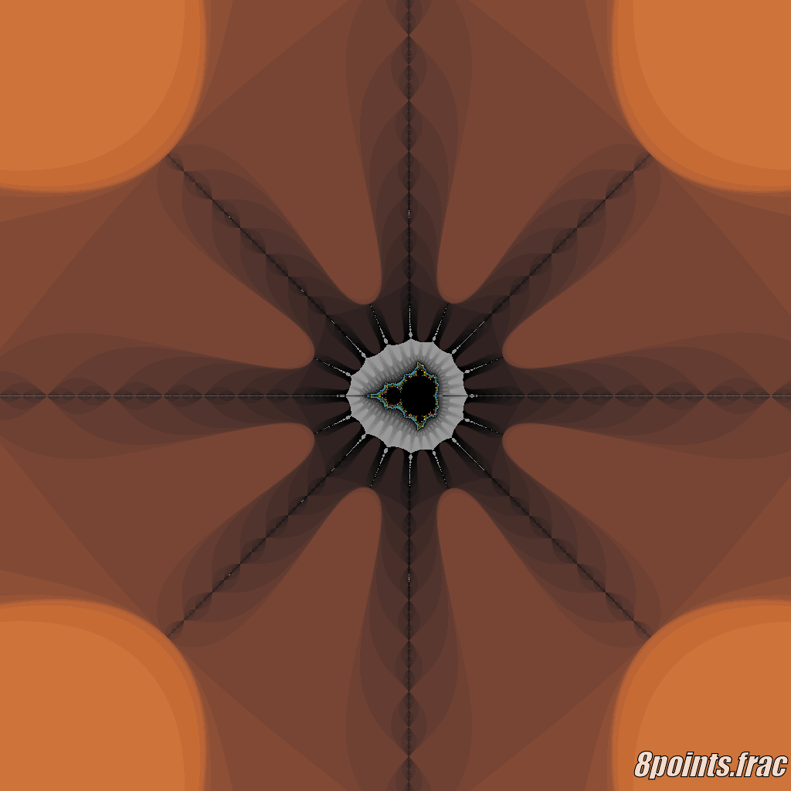

## branches100.frac

A branching spiral, rendered to 100 iterations

~~~
type: mandelbrot
pixels: 640
iterations: 100
centerx: 0.354957789387306
centery: -0.338644137198173
axislength: 5.05822370716613e-06
~~~

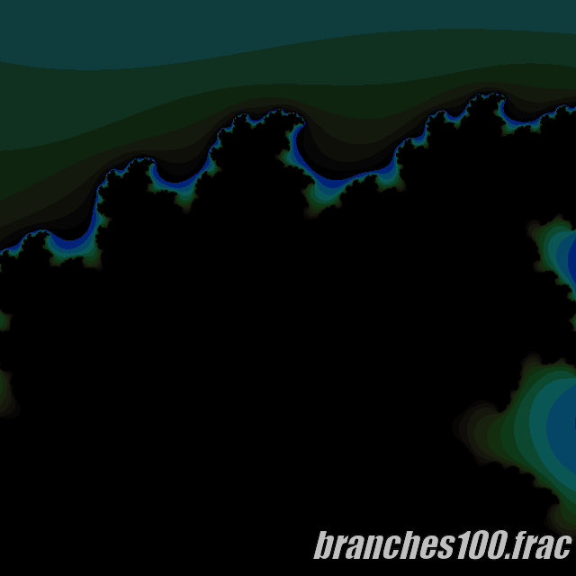

## branches256.frac

A branching spiral, rendered to 256 iterations

~~~
type: mandelbrot
pixels: 640
iterations: 256
centerx: 0.354957789387306
centery: -0.338644137198173
axislength: 5.05822370716613e-06
~~~

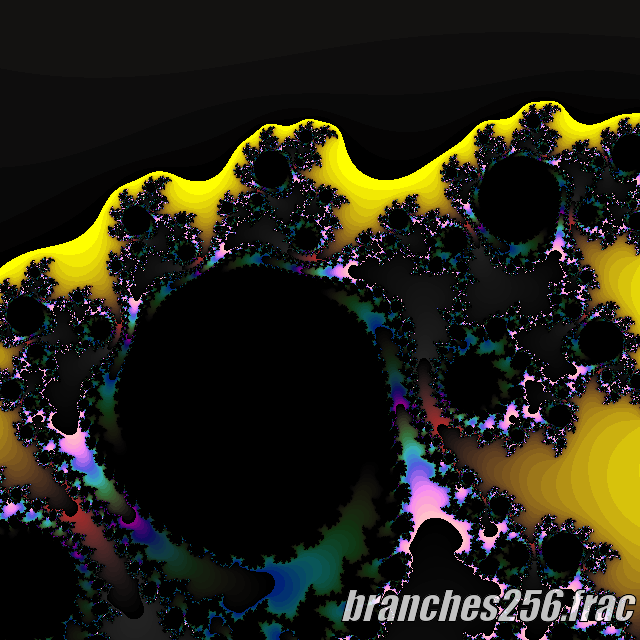

## branches512.frac

A branching spiral, rendered to 512 iterations

~~~
type: mandelbrot
pixels: 640
iterations: 512
centerx: 0.354957789387306
centery: -0.338644137198173
axislength: 5.05822370716613e-06
~~~

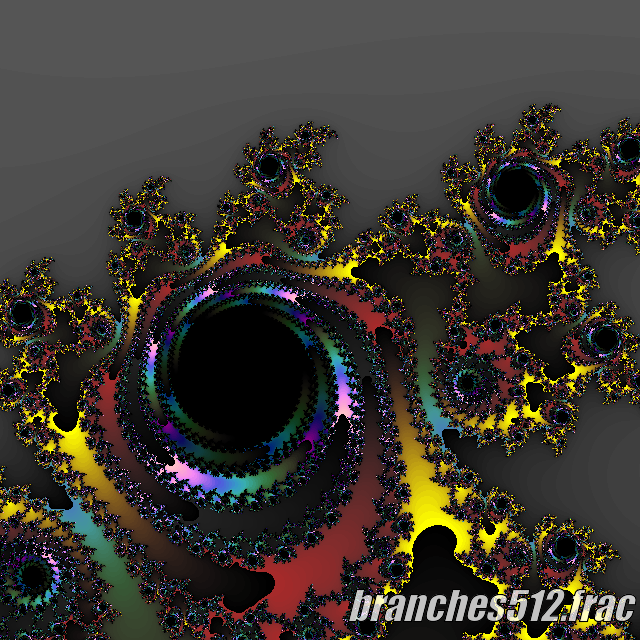

## burningship.frac

A basic Burning Ship Julia fractal

~~~
# You'll need to implement this formula yourself to make your program produce this image
type: burningshipjulia
creal: -.598
cimag: .9225
centerx: 0
centery: 0
axislength: 4
pixels: 512
iterations: 64
~~~

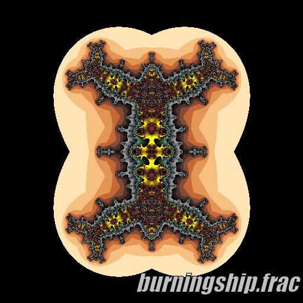

## connected.frac

A connected Julia set fractal

~~~
type: julia
creal: .26
cimag: .0016
centerx: 0
centery: 0
axislength: 2.17
pixels: 512
iterations: 64

# See also unconnected.frac
~~~

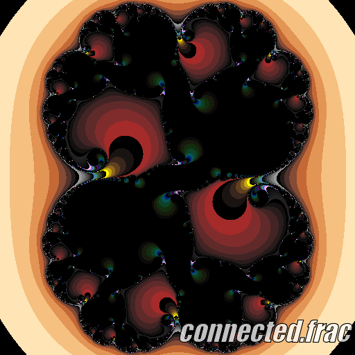

## coral.frac

This one reminds me of coral

~~~
type: Mandelbrot
pixels: 1024
centerX: -0.693792639088625
centerY: -0.36850658033037173
axisLength: 0.005
pixels: 640
iterations: 512
~~~

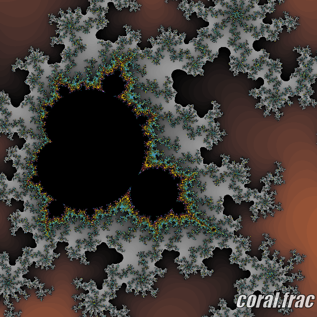

## elephants.frac

Can you see upside-down elephants swinging their trunks?

~~~
type: mandelbrot
pixels:     640
centerx:    0.30820836067024604
centery:    0.030620936230004017
axislength: 0.03
iterations: 100
~~~

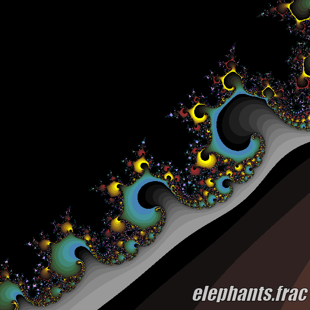

## enhance.frac

Enhance.  Enhance.  ENHANCE!!

~~~
type: mandelbrot
pixels: 512
centerx: -1.48
centery: 0.0
axislength: 0.01
iterations: 300
~~~

## fulljulia.frac

The full julia set, but these creal and cimag values are BORING

~~~
type: julia
creal: -1
cimag: 0
pixels: 1024
centerx: 0.0
centery: 0.0
axislength: 4.0
iterations: 78
~~~

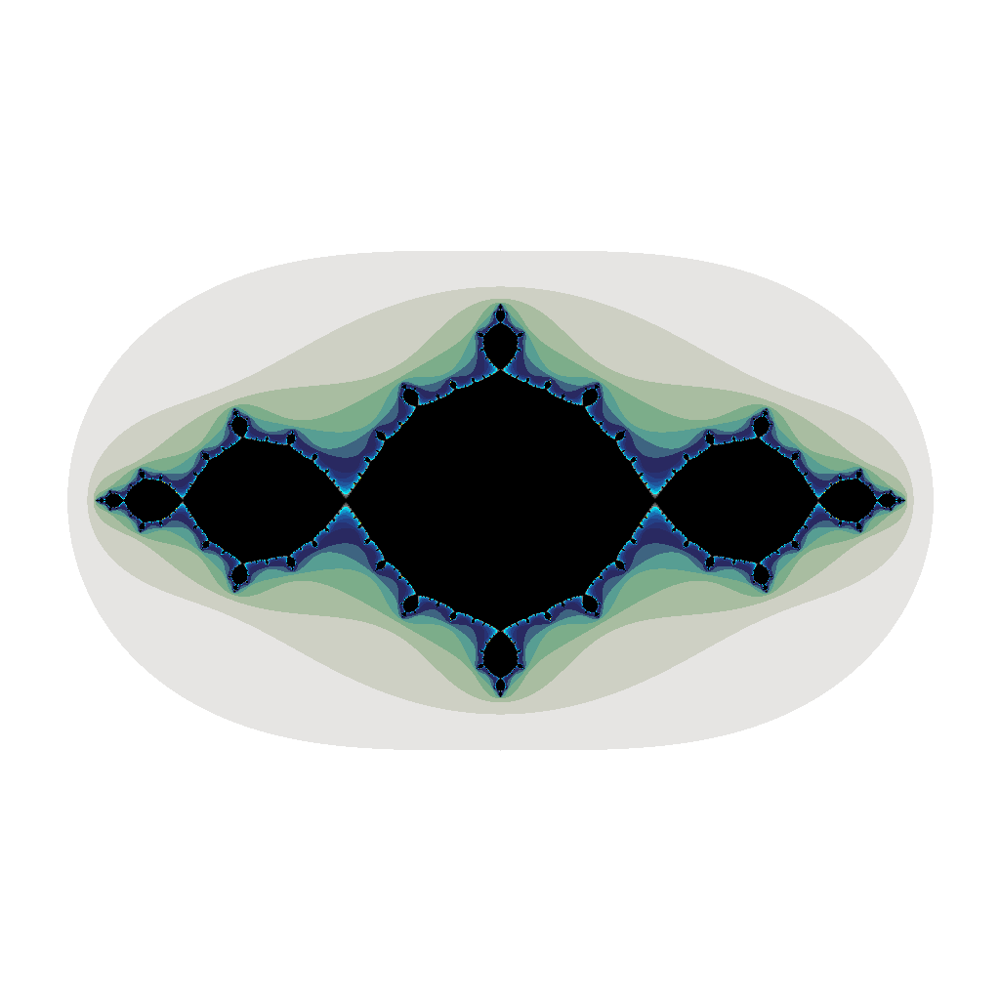

## hourglass.frac

I think this looks like an hourglass

~~~
type: julia
creal: -1
cimag: 0
pixels: 1024

# I guess "X marks the spot" works, too.  Naming stuff is hard, okay?

centerx: 0.618
centery: 0.0
axislength: 0.017148277367054
iterations: 78
~~~

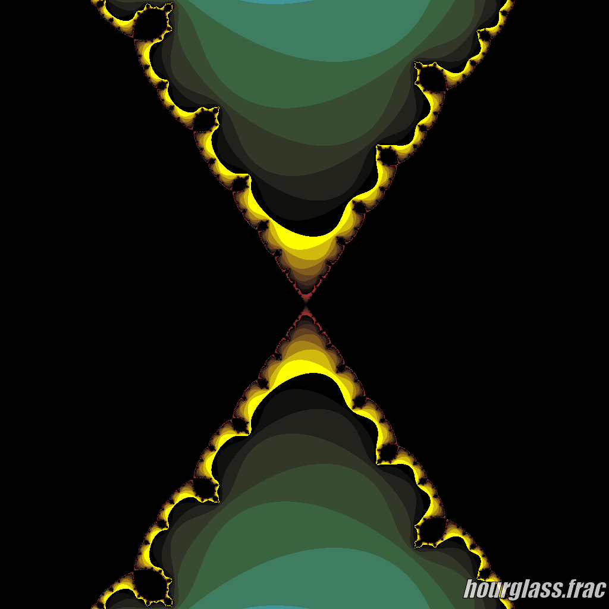

## invalid.frac

This is a purposefully broken fractal config file

~~~
# Use this to stress-test your configuration file parser
# Here be dragons!
Type: BurningShipJulia
centerX: in the middle
centerY:
Itertons: 23.654
PIXELS: 894.965
cImag: 0.3
Type: this is redundant
Type: no matter, this will all be forgotten in a moment
Type: julia
~~~

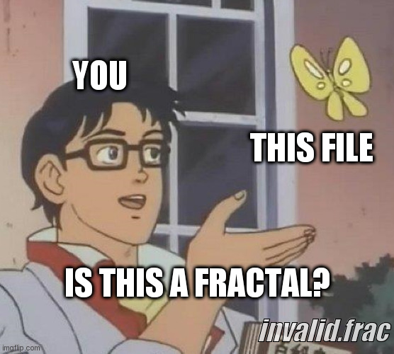

## lace-curtians.frac

My grandmother has lace curtains that look JUST LIKE THIS!

~~~
type:   Julia
pixels: 640
iterations: 512
centerX: -1.01537721564149
centerY: 0.249425427273733
axisLength: 0.0121221433855615
cReal: -1.0
cImag: 0.0
# Disregard these comments...
# minReal:-1.0234586445652 maxReal:-1.00729578671778
# minImag:0.243364355580952 maxImag:0.255486498966514
~~~

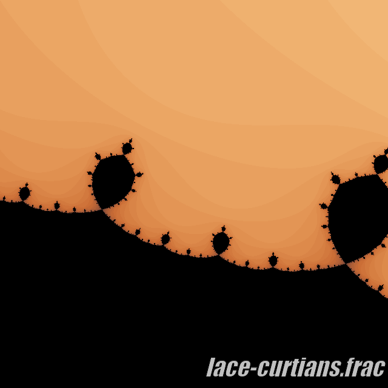

## lakes.frac

Maybe it's the shoreline of some lakes?

~~~
# Found in http://bl.ocks.org/syntagmatic/raw/3736720/ with these parameters
# realmin:-0.479428184021078 realmax:-0.199032752981838
# imagmin:0.335501513801008 imagmax:0.50044000264762
# cr:-1 ci:0
#
# Their rendering algorithm outputs this image upside-down relative to ours

type: julia
creal: -1
cimag: 0
pixels: 512
centerx: -0.339230468501458
centery: 0.417970758224314
axislength: 0.164938488846612
iterations: 48
~~~

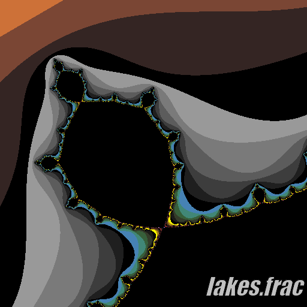

## leaf.frac

Veins on a leaf.  I found this one in GNU XaoS.

~~~
type: mandelbrot
pixels: 640
centerx:     -1.543577002
centery:     -0.000058690069
axislength:  0.000051248888
iterations: 100

# ;position file automatically generated by xaos 3.6
# ;  - a realtime interactive fractal zoomer
# ;use xaos -load <filename> to display it
# (initstate)
# (defaultpalette 0)
# (formula 'mandel)
# (view -1.543579272 -7.502286298e-05 8.632770454e-06 8.632770454e-06)
~~~

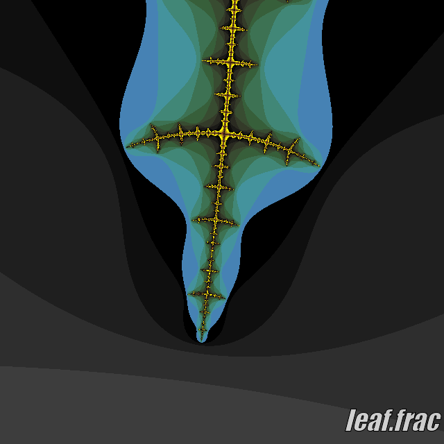

## mandelbrot.frac

Basic mandelbrot set, fully zoomed out

~~~
type: mandelbrot
pixels: 640
centerx: 0.0
centery: 0.0
axislength: 4.0
iterations: 100
~~~

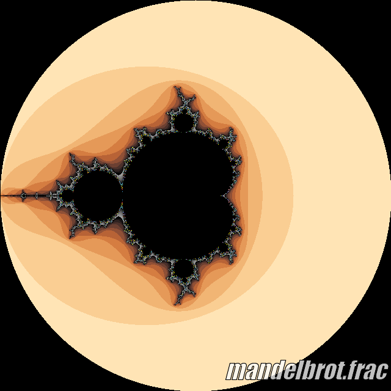

## mandelbrot-zoomed.frac

Basic mandelbrot set, zoomed in a bit and with more iterations

~~~
type: mandelbrot
pixels: 640
centerx: -1.0
centery: 0.0
axislength: 1.0
iterations: 256
~~~

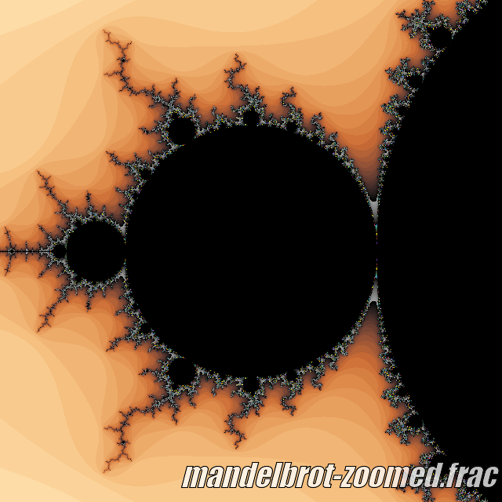

## mandelfour.frac

Mandelbrot^4, fully zoomed out

~~~
type: mandelbrot4
pixels: 640
centerx: 0.0
centery: 0.0
axislength: 4.0
iterations: 100
~~~

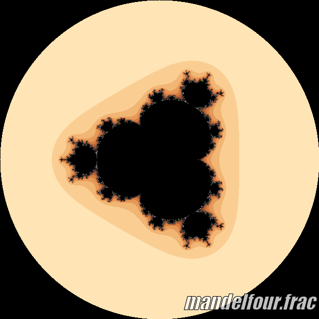

## mandelthree.frac

Mandelbrot^3, fully zoomed out

~~~
type: mandelbrot3
pixels: 640
centerx: 0.0
centery: 0.0
axislength: 4.0
iterations: 100
~~~

## minibrot.frac

uWu... it's just so cute and TINY!

~~~
type: mandelbrot
pixels: 1024
centerx: -1.40812110900879
centery: -0.136344909667969
axislength: 0.0028839111328125
iterations: 350
~~~

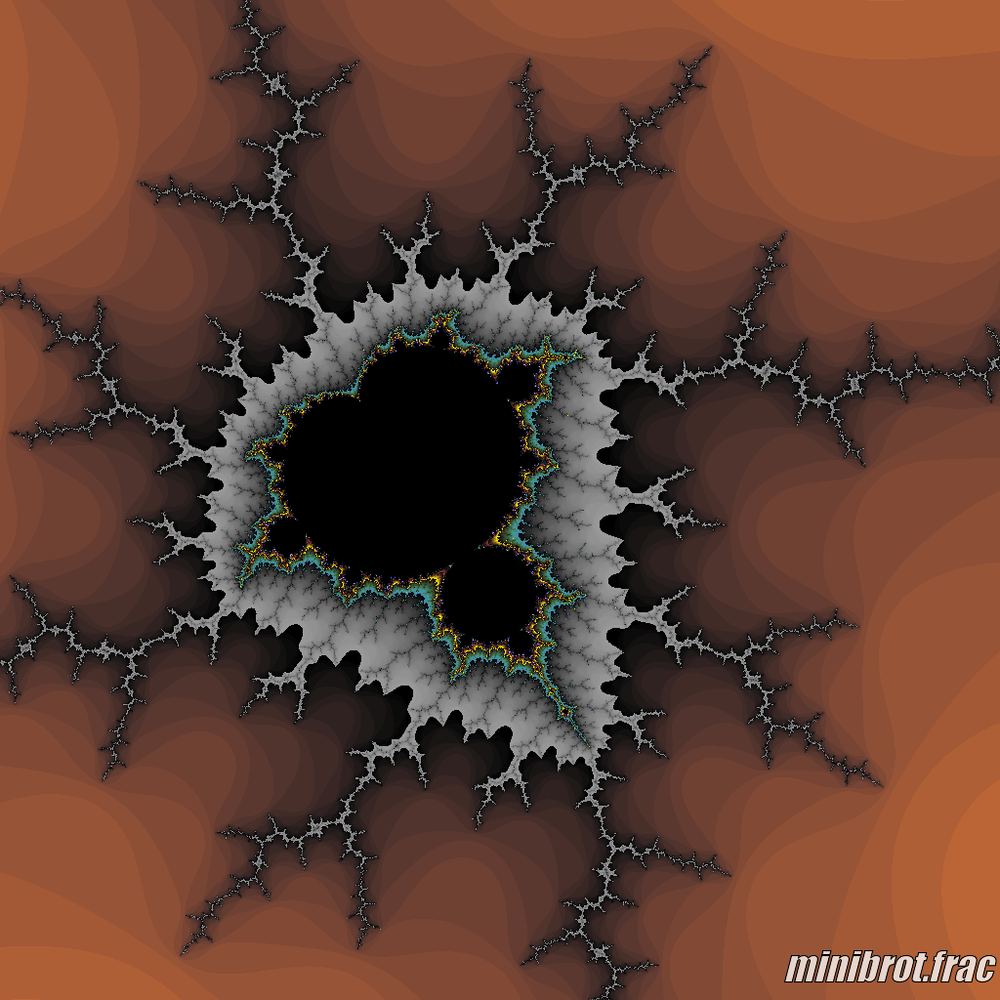

## rabbit-hole.frac

Down the rabbit  h o l e   y  o  u       g     o

~~~
type:   mandelbrot
pixels: 640
iterations: 256
centerx: -0.76
centery: 0.117684887459807
axislength: 0.204501607717042
~~~

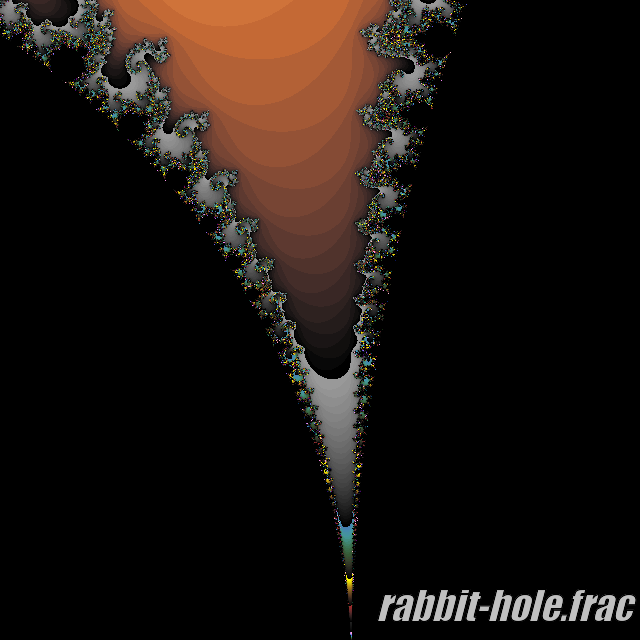

## seahorse.frac

I can see the sea horse.  Can you?

~~~
type: mandelbrot
pixels: 640
centerx: -0.745
centery:  0.105
axislength: 0.01
iterations: 384
~~~

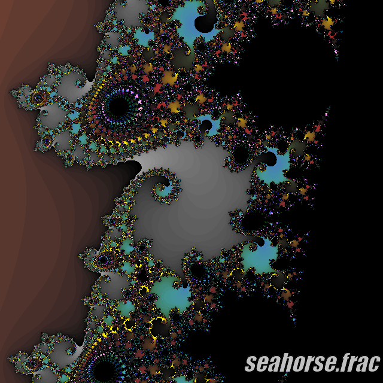

## spiral0.frac

spiral0 from the original starter code

~~~
type: mandelbrot
pixels: 640
centerx: -0.761335372924805
centery: 0.0835704803466797
axislength: 0.00497817993164062
iterations: 512
~~~

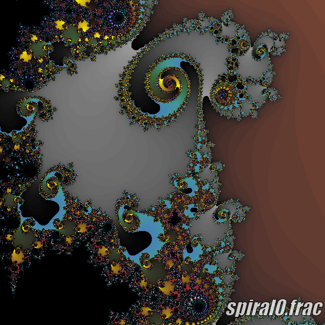

## spiral1.frac

spiral1 from the original starter code

~~~
type: mandelbrot
pixels: 640
centerx: -0.747
centery: 0.1075
axislength: 0.002
iterations: 100
~~~

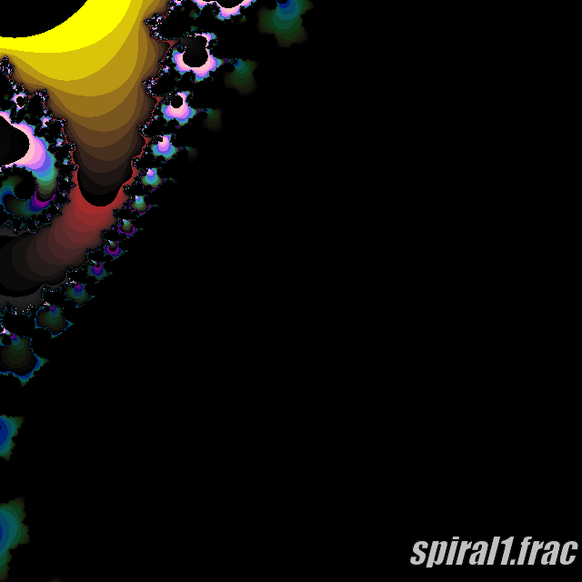

## spiral-jetty.frac

An homage to Utah's official work of art

~~~
# Have you ever visited the northeast shore of the Great Salt Lake?

type: mandelbrot
pixels: 1024
centerx: -0.761335372924805
centery: 0.0835704803466797
axislength: 0.00497817993164062
iterations: 1024
~~~

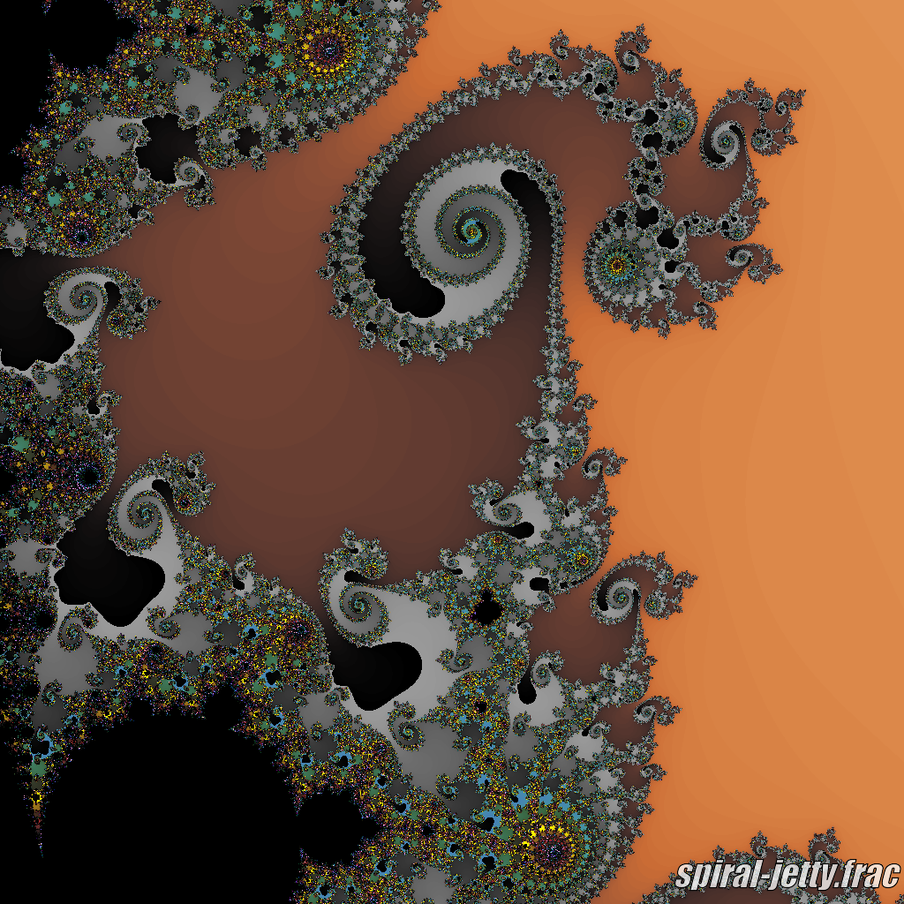

## starfish.frac

Reminds me of a starfish... you can see it, too, right?

~~~
type:   Mandelbrot
pixels: 640
iterations: 312
centerX: -0.463595023481762
centerY: 0.598380871135558
axisLength: 0.00128413675654471
~~~

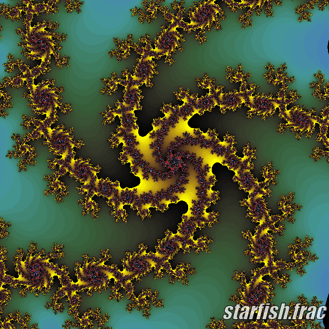

## tip0.frac

A study of the tip of the Mandebrot set's main antenna

~~~
type: Mandelbrot
pixels: 640
centerX: -1.789435
centerY: 0.0
axisLength: 1.9375
iterations: 100
~~~

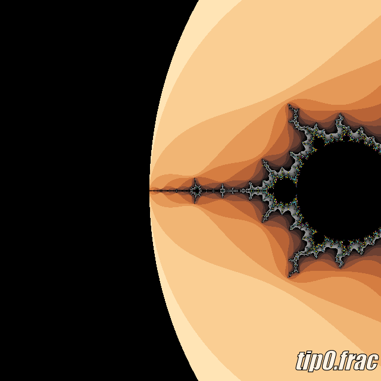

## tip1.frac

A study of the tip of the tip of the Mandebrot set's main antenna

~~~
type: Mandelbrot
pixels: 640
centerX: -1.789435
centerY: 0.0
axisLength: 0.9375
iterations: 100
~~~

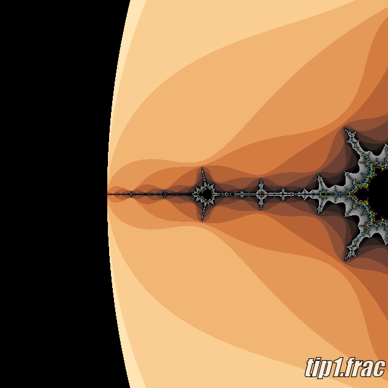

## tip2.frac

A study of the tip of the tip of the tip of the Mandebrot set's main antenna

~~~
type: Mandelbrot
pixels: 640
centerX: -1.789435
centerY: 0.0
axisLength: 0.09375
iterations: 100
~~~

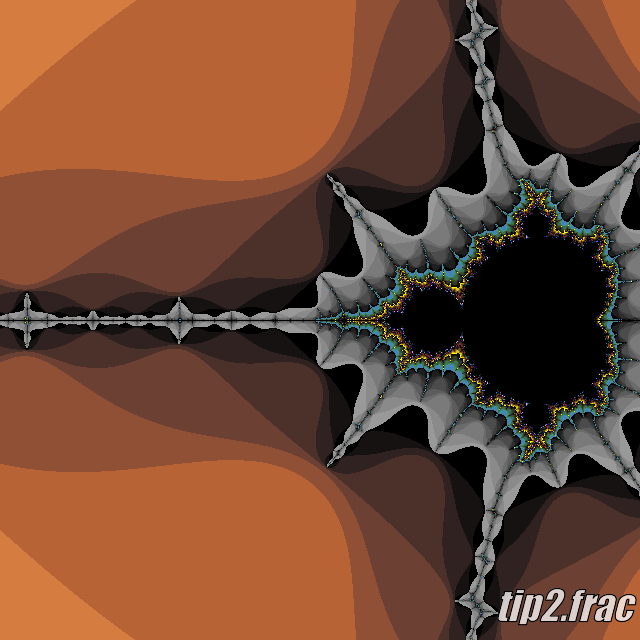

## tip3.frac

A study of the tip of the tip of the tip of the tip of the Mandebrot set's main antenna

~~~
type: Mandelbrot
pixels: 640
centerX: -1.789435
centerY: 0.0
axisLength: 0.009375
iterations: 100
~~~

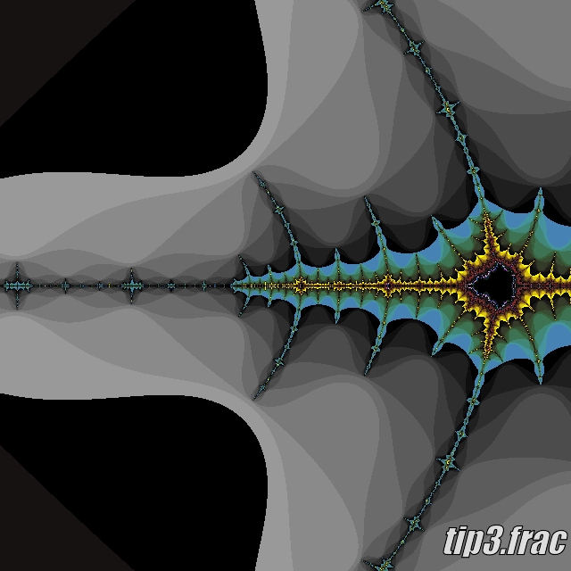

## tip4.frac

A study of the tip of the tip of the tip of the tip of the tip of the Mandebrot set's main antenna

~~~
type: Mandelbrot
pixels: 640
centerX: -1.789435
centerY: 0.0
axisLength: 0.0009375
iterations: 100
~~~

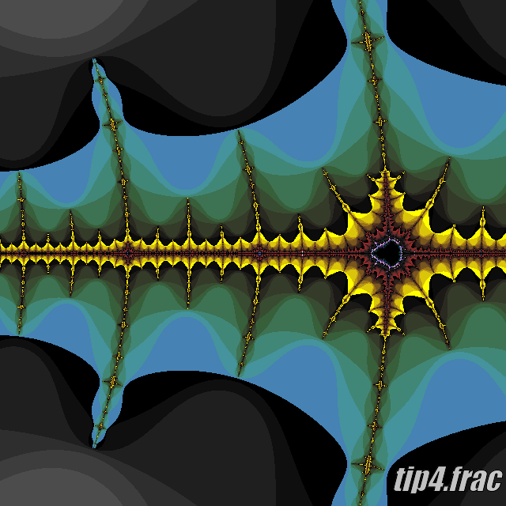

## unconnected.frac

An unconnected Julia set fractal

~~~
type: julia
creal: .26
cimag: .0015
centerx: 0
centery: 0
axislength: 2.17
pixels: 512
iterations: 64

# See also connected.frac
~~~

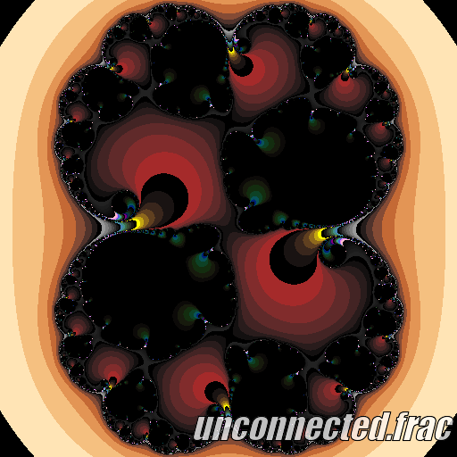

## wholly-squid.frac

Ph'nglui mglw'nafh Cthulhu R'lyeh wgah'nagl fhtagn!

~~~
type: mandelbrot
pixels: 640
iterations: 256
centerx: -0.744740098129553
centery: 0.209610393372855
axislength: 0.00160629282219288
~~~

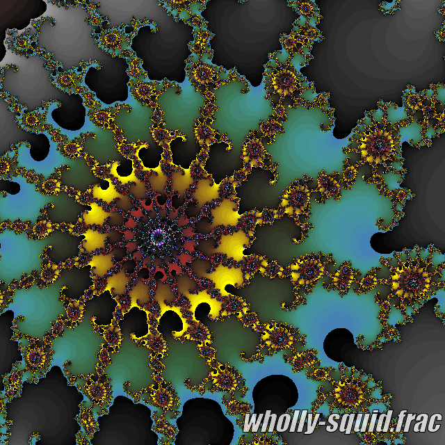

