# Fractal Configuration Files

This directory contains all default configuration files. Below are the settings for each configuration file, and an image generated from these settings. 

## 8points.frac

The characteristic Mandelbrot shape embedded within an 8-pointed compass

~~~
type: Mandelbrot
pixels: 1024
centerX: -1.999774061505
centerY: -0.0
axisLength: 0.000000361314
iterations: 350
~~~

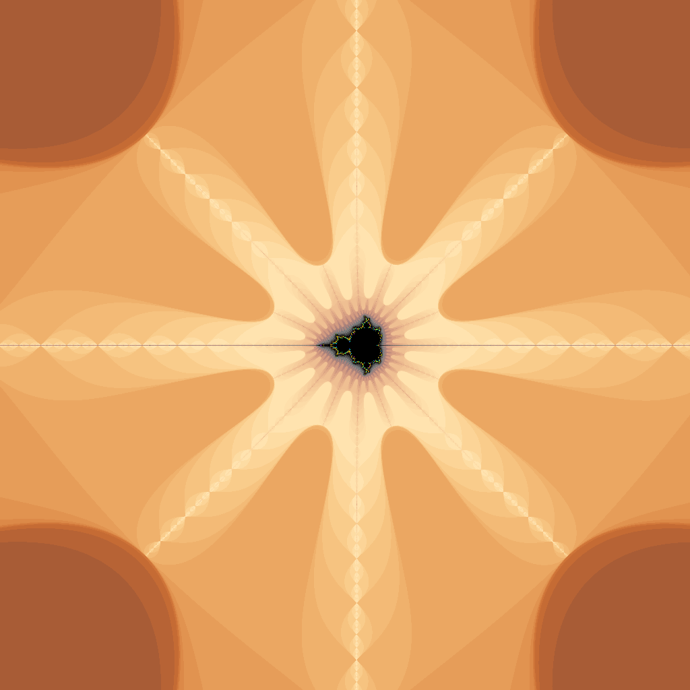

## branches100.frac

A branching spiral, rendered to 100 iterations

~~~
type: mandelbrot
pixels: 640
iterations: 100
centerx: 0.354957789387306
centery: -0.338644137198173
axislength: 5.05822370716613e-06
~~~

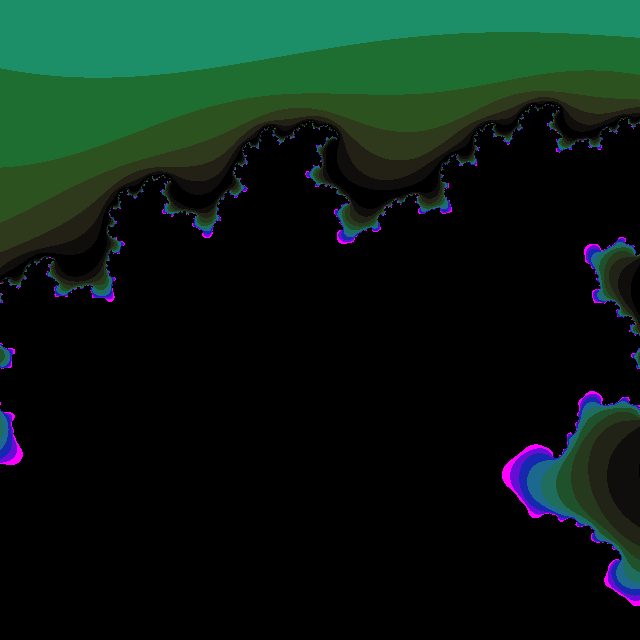

## branches256.frac

A branching spiral, rendered to 256 iterations

~~~
type: mandelbrot
pixels: 640
iterations: 256
centerx: 0.354957789387306
centery: -0.338644137198173
axislength: 5.05822370716613e-06
~~~

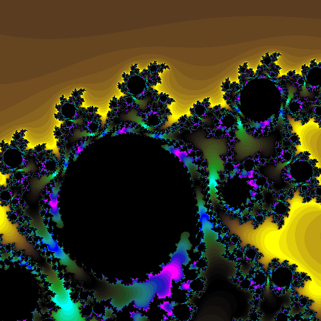

## branches512.frac

A branching spiral, rendered to 512 iterations

~~~
type: mandelbrot
pixels: 640
iterations: 512
centerx: 0.354957789387306
centery: -0.338644137198173
axislength: 5.05822370716613e-06
~~~

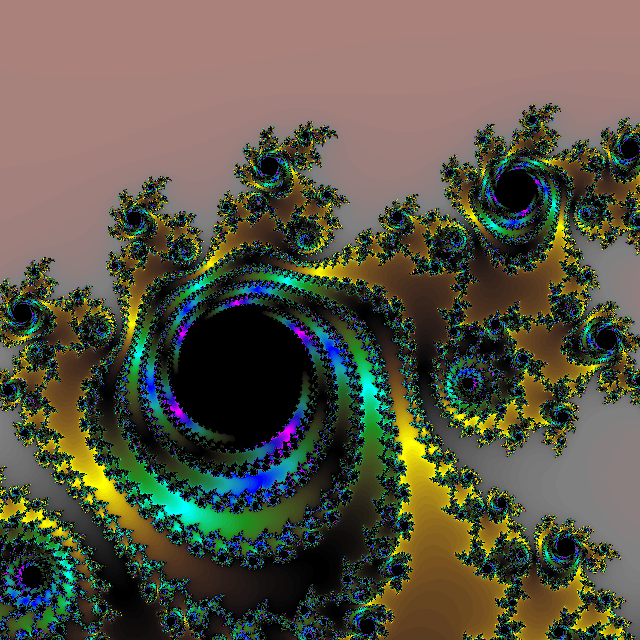

## connected.frac

A connected Julia set fractal

~~~
type: julia
creal: .26
cimag: .0016
centerx: 0
centery: 0
axislength: 2.17
pixels: 512
iterations: 64

# See also unconnected.frac
~~~

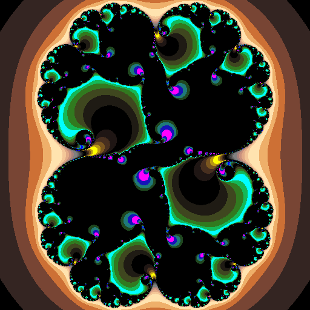

## coral.frac

Madelbrot fractal that looks like coral

~~~
type: Mandelbrot
pixels: 1024
centerX: -0.693792639088625
centerY: -0.36850658033037173
axisLength: 0.005
pixels: 640
iterations: 512
~~~

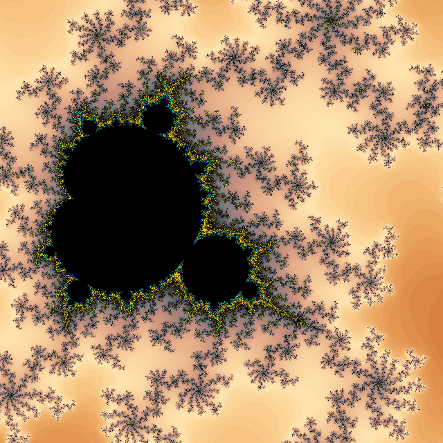

## elephants.frac

~~~
type: mandelbrot
pixels:     640
centerx:    0.30820836067024604
centery:    0.030620936230004017
axislength: 0.03
iterations: 100
~~~

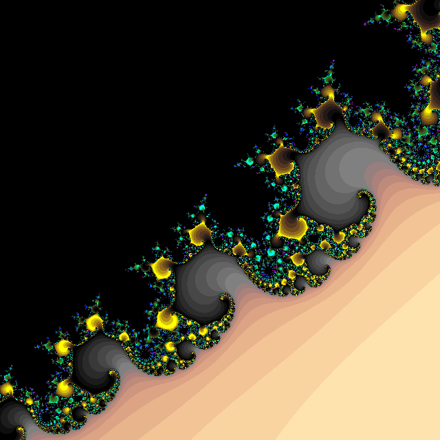

## enhance.frac

~~~
type: mandelbrot
pixels: 512
centerx: -1.48
centery: 0.0
axislength: 0.01
iterations: 300
~~~

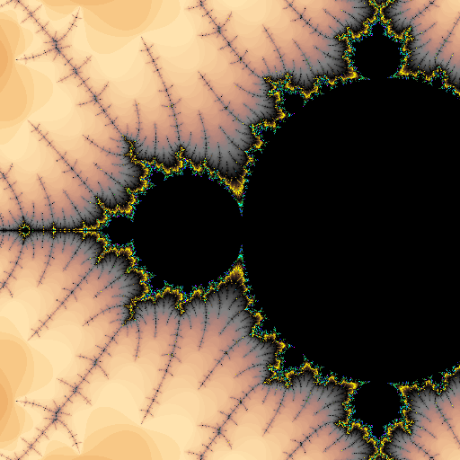

## fulljulia.frac

The full julia set, with slightly different creal and cimg values

~~~
type: julia
creal: -1
cimag: 0
pixels: 1024
centerx: 0.0
centery: 0.0
axislength: 4.0
iterations: 78
~~~

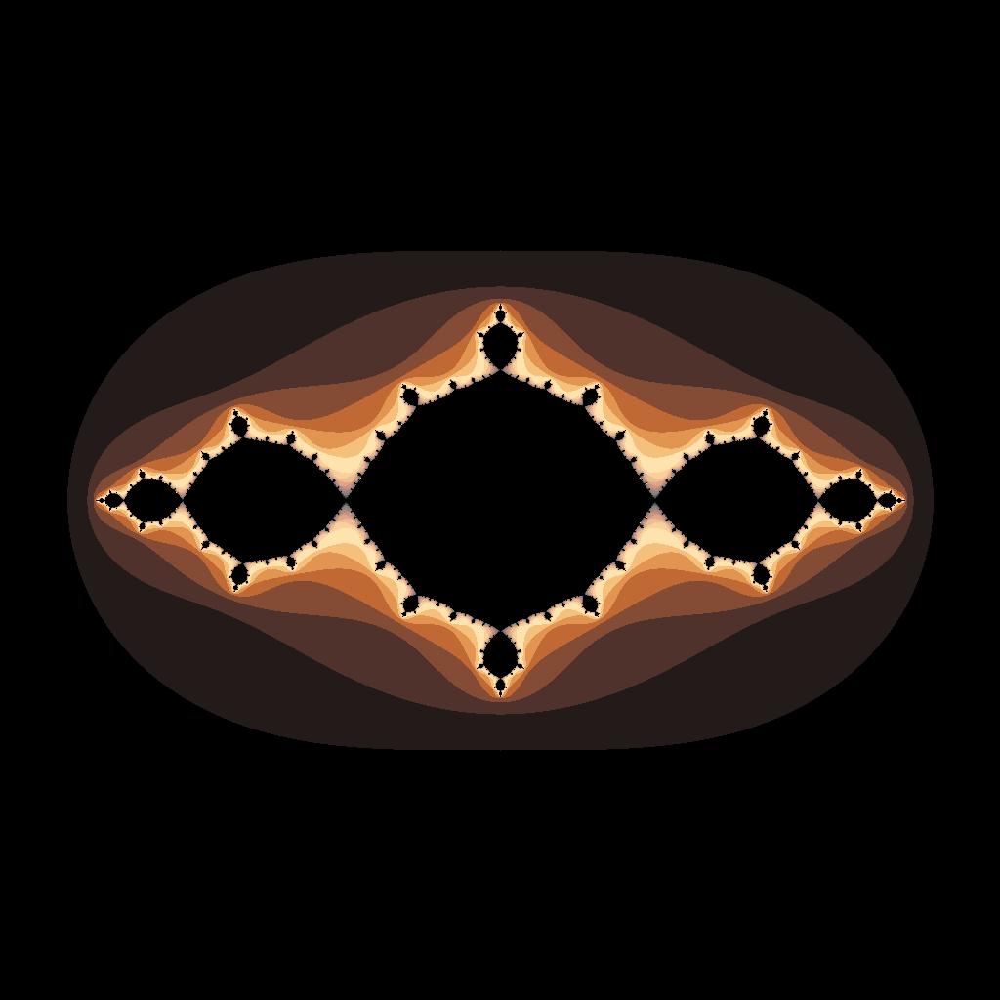

## hourglass.frac
~~~
type: julia
creal: -1
cimag: 0
pixels: 1024
centerx: 0.618
centery: 0.0
axislength: 0.017148277367054
iterations: 78
~~~

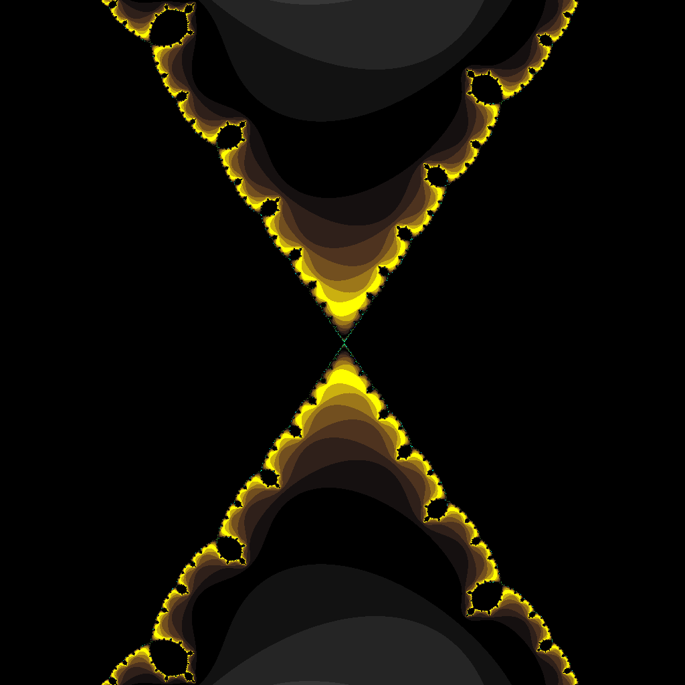

## lace-curtians.frac
~~~
type:   Julia
pixels: 640
iterations: 512
centerX: -1.01537721564149
centerY: 0.249425427273733
axisLength: 0.0121221433855615
cReal: -1.0
cImag: 0.0
# Disregard these comments...
# minReal:-1.0234586445652 maxReal:-1.00729578671778
# minImag:0.243364355580952 maxImag:0.255486498966514
~~~

## lakes.frac
~~~
type: julia
creal: -1
cimag: 0
pixels: 512
centerx: -0.339230468501458
centery: 0.417970758224314
axislength: 0.164938488846612
iterations: 48
~~~

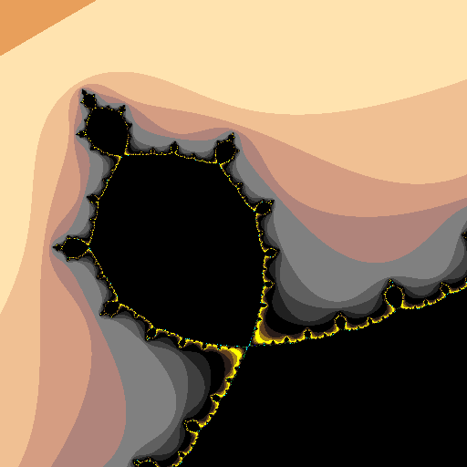

## leaf.frac
~~~
type: mandelbrot
pixels: 640
centerx:     -1.543577002
centery:     -0.000058690069
axislength:  0.000051248888
iterations: 100
~~~

## mandelbrot.frac

Basic mandelbrot set, fully zoomed out

~~~
type: mandelbrot
pixels: 640
centerx: 0.0
centery: 0.0
axislength: 4.0
iterations: 100
~~~

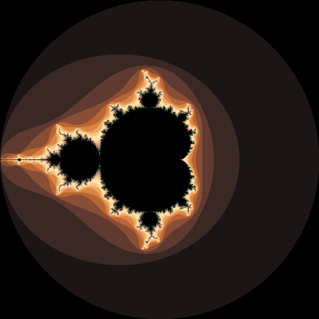

## mandelbrot-zoomed.frac

Basic mandelbrot set, zoomed in a bit and with more iterations

~~~
type: mandelbrot
pixels: 640
centerx: -1.0
centery: 0.0
axislength: 1.0
iterations: 256
~~~

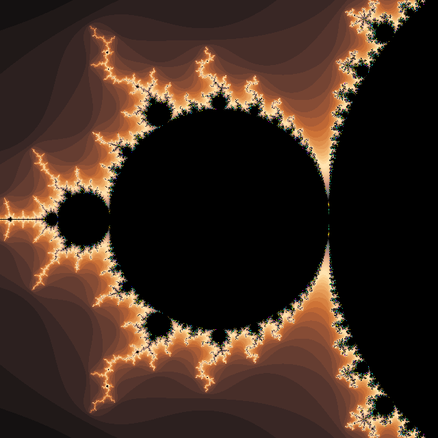

## mandelfour.frac

Mandelbrot^4, fully zoomed out

~~~
type: mandelbrot4
pixels: 640
centerx: 0.0
centery: 0.0
axislength: 4.0
iterations: 100
~~~

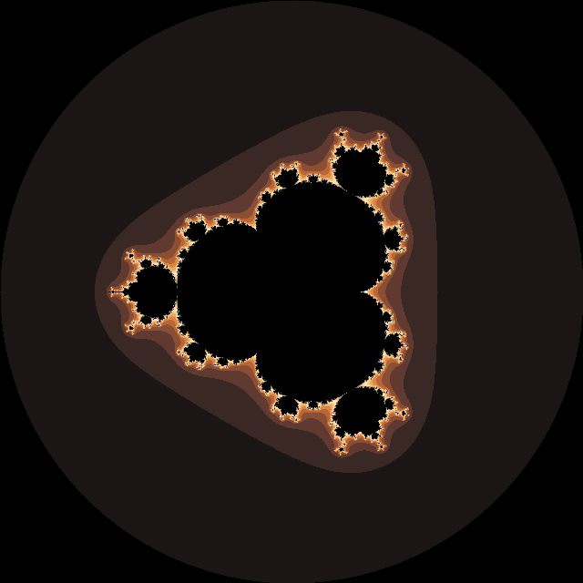

## mandelthree.frac

Mandelbrot^3, fully zoomed out

~~~
type: mandelbrot3
pixels: 640
centerx: 0.0
centery: 0.0
axislength: 4.0
iterations: 100
~~~

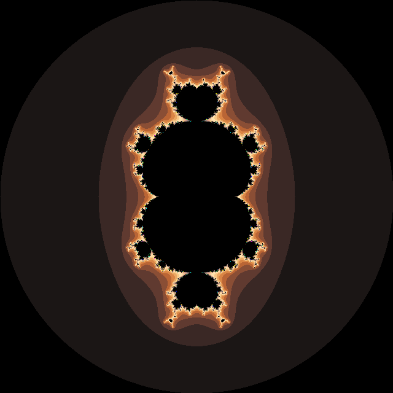

## minibrot.frac
~~~
type: mandelbrot
pixels: 1024
centerx: -1.40812110900879
centery: -0.136344909667969
axislength: 0.0028839111328125
iterations: 350
~~~

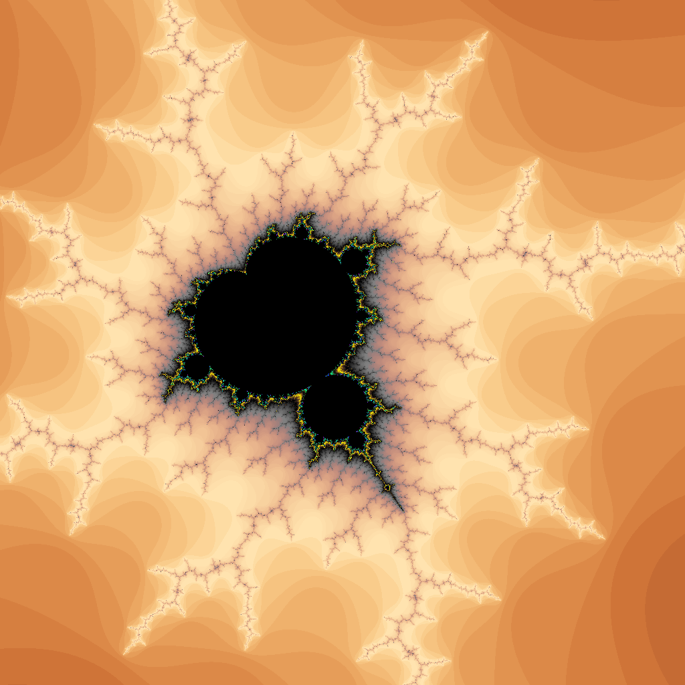

## rabbit-hole.frac
~~~
type:   mandelbrot
pixels: 640
iterations: 256
centerx: -0.76
centery: 0.117684887459807
axislength: 0.204501607717042
~~~

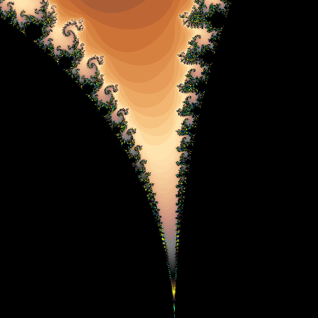

## seahorse.frac
~~~
type: mandelbrot
pixels: 640
centerx: -0.745
centery:  0.105
axislength: 0.01
iterations: 384
~~~

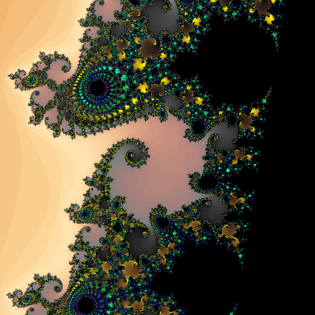

## spiral0.frac
~~~
type: mandelbrot
pixels: 640
centerx: -0.761335372924805
centery: 0.0835704803466797
axislength: 0.00497817993164062
iterations: 512
~~~

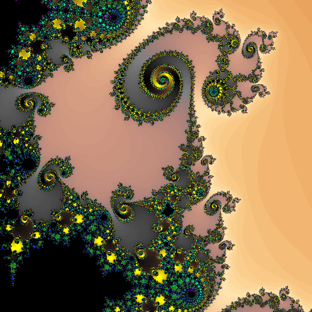

## spiral1.frac
~~~
type: mandelbrot
pixels: 640
centerx: -0.747
centery: 0.1075
axislength: 0.002
iterations: 100
~~~

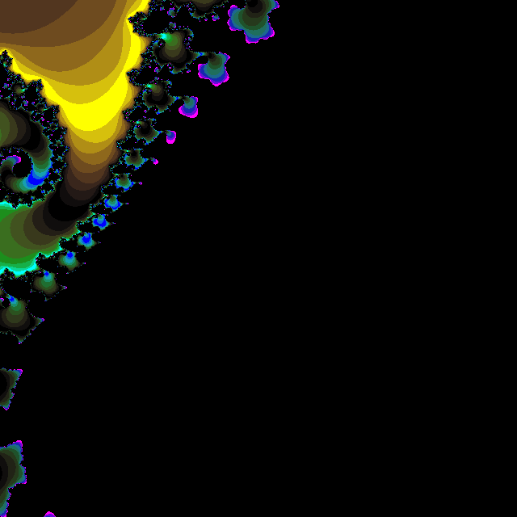

## spiral-jetty.frac
~~~
type: mandelbrot
pixels: 1024
centerx: -0.761335372924805
centery: 0.0835704803466797
axislength: 0.00497817993164062
iterations: 1024
~~~

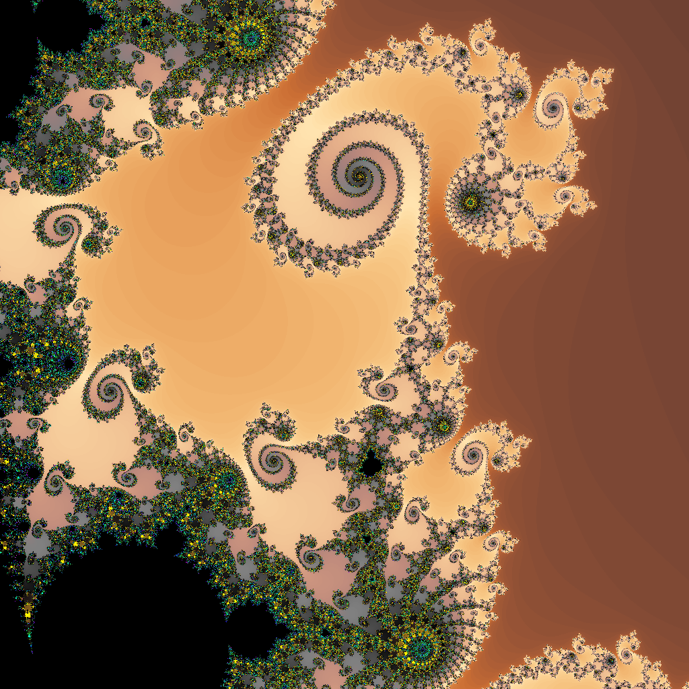

## starfish.frac
~~~
type:   Mandelbrot
pixels: 640
iterations: 312
centerX: -0.463595023481762
centerY: 0.598380871135558
axisLength: 0.00128413675654471
~~~

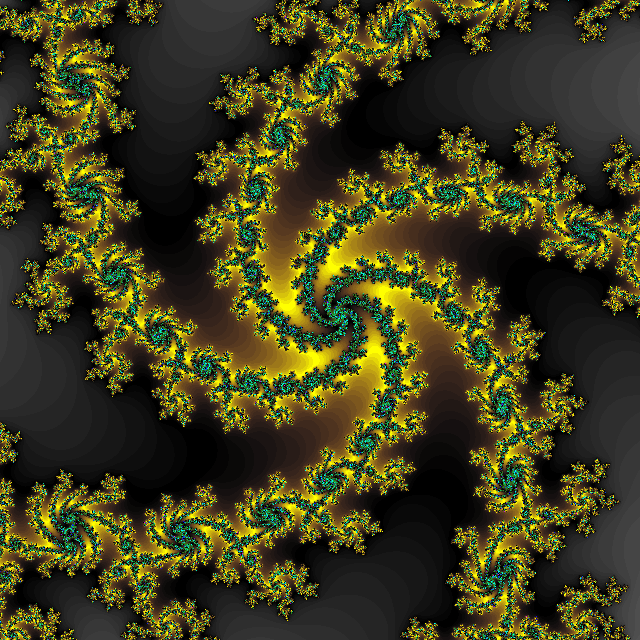

## tip0.frac

A study of the tip of the Mandebrot set's main antenna

~~~
type: Mandelbrot
pixels: 640
centerX: -1.789435
centerY: 0.0
axisLength: 1.9375
iterations: 100
~~~

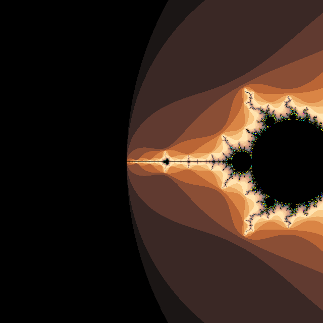

## tip1.frac

A study of the tip of the tip of the Mandebrot set's main antenna

~~~
type: Mandelbrot
pixels: 640
centerX: -1.789435
centerY: 0.0
axisLength: 0.9375
iterations: 100
~~~

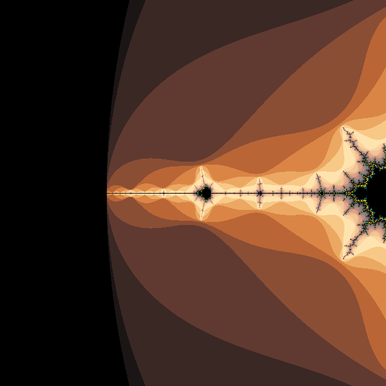

## tip2.frac

A study of the tip of the tip of the tip of the Mandebrot set's main antenna

~~~
type: Mandelbrot
pixels: 640
centerX: -1.789435
centerY: 0.0
axisLength: 0.09375
iterations: 100
~~~

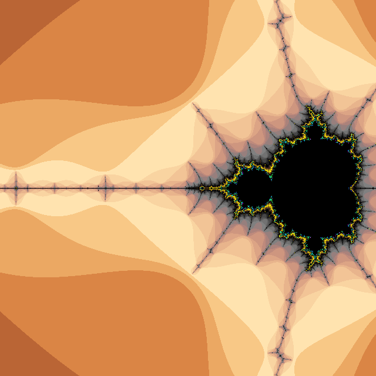

## tip3.frac

A study of the tip of the tip of the tip of the tip of the Mandebrot set's main antenna

~~~
type: Mandelbrot
pixels: 640
centerX: -1.789435
centerY: 0.0
axisLength: 0.009375
iterations: 100
~~~

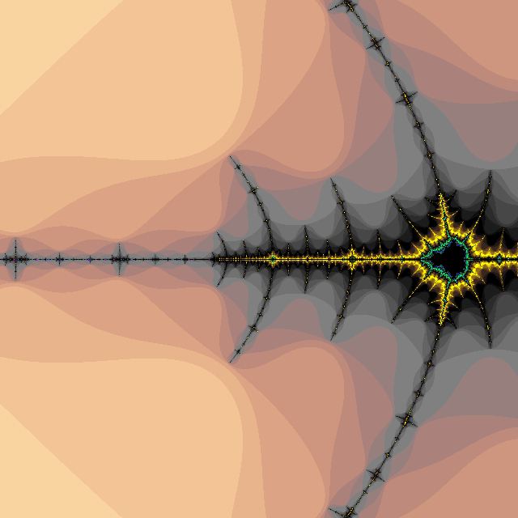

## tip4.frac

A study of the tip of the tip of the tip of the tip of the tip of the Mandebrot set's main antenna

~~~
type: Mandelbrot
pixels: 640
centerX: -1.789435
centerY: 0.0
axisLength: 0.0009375
iterations: 100
~~~

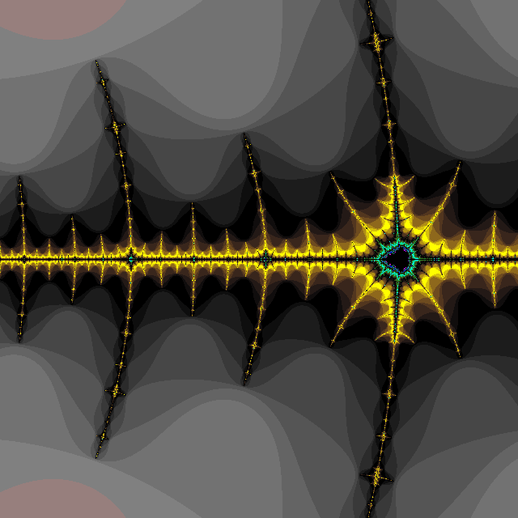

## unconnected.frac

An unconnected Julia set fractal

~~~
type: julia
creal: .26
cimag: .0015
centerx: 0
centery: 0
axislength: 2.17
pixels: 512
iterations: 64
~~~

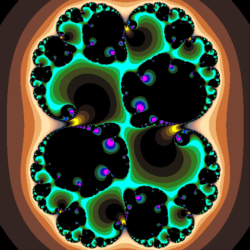

## wholly-squid.frac
~~~
type: mandelbrot
pixels: 640
iterations: 256
centerx: -0.744740098129553
centery: 0.209610393372855
axislength: 0.00160629282219288
~~~

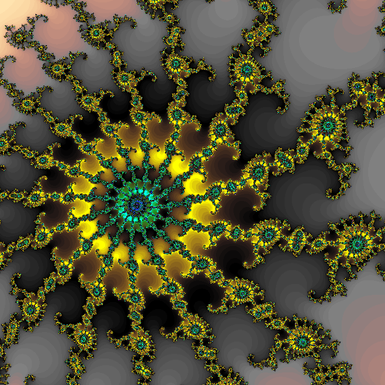

