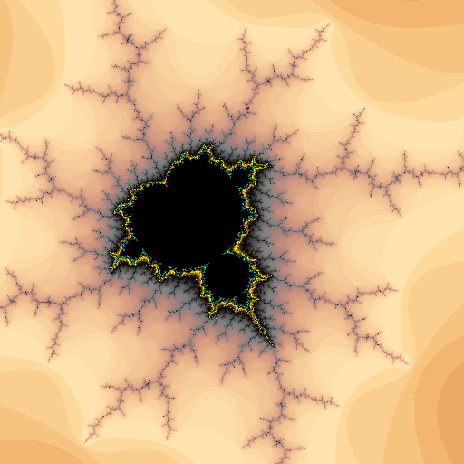

# Fractal Visualizer User Manual

**To run this program use this command in your terminal:**
```commandline
python src/main.py
```
**If you are a Mac user, use this command in your terminal:**
```commandline
python3 src/main.py
```
**This command creates a default fractal image**
* You will be greeted with these prompts
```commandline
creating default fractal
creating a default palette
Done in 8.507 seconds!
Wrote image default.png
Close the image window to exit the program
```
* You will also have a separate window displaying the default fractal image

*Once you're done with the image, close the window and the program will exit*





**To create a different fractal simply enter the file name of a fractal configuration file**


*Here are all the options to choose from below:*
```commandline
8points.frac	            burningship.frac		    lakes.frac	        spiral-jetty.frac			
fulljulia.frac		    mandelthree.frac		    tip1.frac		unconnected.frac
connected.frac		    leaf.frac		            spiral0.frac	wholly-squid.frac
branches100.frac	    hourglass.frac	            minibrot.frac       tip2.frac		
coral.frac		    mandelbrot-zoomed.frac	    spiral1.frac        tip3.frac
branches256.frac	    invalid.frac	            rabbit-hole.frac    tip4.frac
elephants.frac		    mandelbrot.frac		    starfish.frac		
branches512.frac	    lace-curtians.frac	            seahorse.frac				
enhance.frac	            mandelfour.frac		    tip0.frac		
```

**Chose your option and then enter it into the command line like so:**

*This will be demonstrating how to create a spiral0.frac fractal*

```commandline
python3 src/main.py data/spiral0.frac
```

*These will be the prompts you see as well as the second window that opens*

```commandline
creating a spiral0 fractal
creating a default palette
Done in 11.098 seconds!
Wrote image spiral0.png
Close the image window to exit the program
```


**To create a fractal with a new color palette, use these commands:**

```commandline
python3 src/main.py data/spiral0.frac gold
```

or 


```commandline
python3 src/main.py data/spiral0.frac rainbow
```


**These commands must be given after the desired fractal, and cannot be given on their own**


*For example this command is illigal:*


```commandline
python3 src/main.py rainbow
```


*How do the configuration files work?*


**In order to create a new configuration file, it must contain all of these items:**

*Mandelbrot must follow these conditions*
```commandline
type: Mandelbrot
pixels: 1024
centerX: -0.693792639088625
centerY: -0.36850658033037173
axisLength: 0.005
pixels: 640
iterations: 512
```


**Mandelbrot types must have the following components:**  *'type', 'centerx' and 'centery', 'axisLength', 'pixels', and 'iterations'* **All seperated by a colon**

*Julia must follow these conditions*
```commandline
type: julia
creal: -1
cimag: 0
pixels: 1024
centerx: 0.0
centery: 0.0
axislength: 4.0
iterations: 78
```

**Julia types must have the following components:**  *'type', 'centerx' and 'centery', 'axisLength', 'pixels', 'iterations' 'creal', and 'cimag'* **All seperated by a colon**


*Any components missing will result in a crashing program*


*Components must have the same types and formatting as seen above*


**This is what happens when an invalid file is given:**

```commandline
python3 src/main.py data/invalid.frac   
  
Traceback (most recent call last):
  File "/Users/gavinrobey/cs1440-robey-gavin-assn4/src/main.py", line 28, in <module>
    fractalInformation = FractalParser(sys.argv[1]).getConfiguration()
  File "/Users/gavinrobey/cs1440-robey-gavin-assn4/src/FractalParser.py", line 31, in getConfiguration
    self.__verify()
  File "/Users/gavinrobey/cs1440-robey-gavin-assn4/src/FractalParser.py", line 41, in __verify
    self.__checkMissing()
  File "/Users/gavinrobey/cs1440-robey-gavin-assn4/src/FractalParser.py", line 58, in __checkMissing
    raise RuntimeError(f"The required parameter '{self.__missingItems()[0]}' is missing")
RuntimeError: The required parameter 'axislength' is missing
```

**This crashed because, the file given is missing important items, here are the contents of the file:**


```commandline
# This is a purposefully broken fractal config file
# Use this to stress-test your configuration file parser
# Here be dragons!
Type: BurningShipJulia
centerX: in the middle
centerY:
Itertons: 23.654
PIXELS: 894.965
cImag: 0.3
Type: this is redundant
Type: no matter, this will all be forgotten in a moment
Type: julia
```


