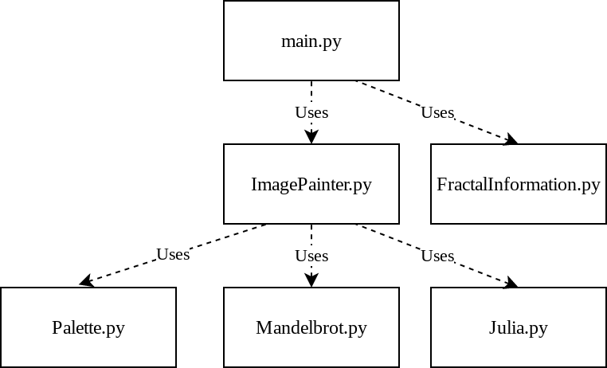

# CS 1440 Assignment 4.0 Instructions

## Description

Read and understand a working but *smelly* program.  Identify all code smells
in the starter code.  Refactor the code into an equivalent program that
outwardly behaves the same, but is inwardly clean, elegant and easy to read.
Create helpful documentation and improve the coverage of unit tests.


## Previous Semester Assignment Statistics

Statistic                        | Value
--------------------------------:|:---------------
Average Hours Spent              | 11.5
Average Score % (Grade)          | 85.8% (B)
% students thought this was Easy | 9.9%
... Medium                       | 52.5%
... Hard                         | 29.7%
... Too Hard/Did not complete    | 6.9%


## Overview

You have been assigned to a high-priority project at DuckieCorp to convert a
client's prototype program into a well-factored Programming Systems Product
complete with design and user documentation.  You will work on this project
over two sprints.

Our client wants DuckieCorp to add new features to his starter code.  While
this starter code does not contain any obvious bugs, in its current state it is
not easy to improve upon.  To be perfectly frank, this code is a bit of a mess,
and the client knows it.  Before we can deliver them we must first address the
non-functional aspects of the code base.

In this sprint you will refactor this program into a cleaner, more pliant code
base while keeping the *original functionality intact*.  It is important at
this stage to resist the urge to improve this program's functionality or
performance.

Pure refactoring is about *preserving* existing functionality, even if that
functionality is incorrect.  In the next sprint (Assignment 4.1) you will
complete this project by enhancing the system with new capabilities.

_This is not a hint for you to go looking for some cleverly-hidden bug; there
are no easter-eggs.  Refactor the starter code under the assumption that it
works correctly._


## Objectives

*   Understanding code written by others
    *   Practice reading messy code
    *   Study official documentation
*   Create a Programming System
    *   Organize procedural code into modules
    *   Run and maintain Unit Tests to avoid introducing new bugs
    *   Perform integration testing to ensure the program functions properly
*   Create a Programming Product
    *   Write user-oriented documentation
    *   Draft a UML class diagram describing the system's architecture
*   Refactoring
    *   Identify and mitigate "code smells": programming anti-patterns
    *   Factor out redundant code
    *   Split monolithic code into neat, clean modules
*   Leverage 3rd party libraries to create a fun and visually appealing program


## Submission Instructions

*   You will work on this repository for two sprints.
*   Tag commits at the end of select phases of the SDP:

    0.  Tag `A4.0-analyzed` on the commit at the end of **Phase 1: System Analysis** (you've written `doc/Smells.md`)
    1.  Tag `A4.0-designed` on the commit at the end of **Phase 2: Design** (you've written pseudocode, first draft of the user's manual and UML class diagram)
    2.  Tag `A4.0-implemented` on the commit at the end of **Phase 3: Implementation** (you've refactored the code)
    3.  Tag `A4.0-tested` on the commit at the end of **Phase 4: Testing & Debugging** (you've finished your unit tests)
    4.  Tag the final commit of this sprint `A4.0-deployed`.
        *   The code at this commit is what the graders will assess for this submission
        *   This tag lets you continue to work on Assignment 4.1 in this repository without mistaking those commits as being late submissions on this assignment
        *   Therefore, **`A4.0-deployed`** is the most important tag of all; if it is missing there is a **10 point penalty**
*   Push tags to GitLab before the due date
    *   Mind the capitalization and spelling of your tags!
*   You can give one commit many tags
    *   For example, if you complete multiple phases in one commit, apply all relevant tags
*   These tags don't necessarily need to be in the above order, but all should be present
    *   Likewise, it is okay to change files after its phase is over; you don't need to move the tags when this happens
    *   For example, you will probably find more code smells while in the midst of **Phase 3: Implementation**; add these to `doc/Smells.md`


## Requirements

*   Begin by cloning and studying the starter code
    *   The starter code is runnable out-of-the-box.  If the code crashes before you have begun changing it, refer to [Tkinter Installation & Troubleshooting](./Tkinter.md) for instructions.
*   After you have studied the code and identified everything that is wrong with it, you will clean it up.  You have a lot of latitude in how you can do this.  All of these things are on the table:
    *   Renaming variables
    *   Deleting unused variables or lines of code
    *   Erasing or rewriting misleading code comments
    *   Changing function parameters
*   Refactor the code into a cleanly-written program which retains the original functionality
    *   Create new modules or classes and migrate existing functionality to the right place
*   Write technical documentation for two key audiences
    *   A **User's Manual** for the non-technical audience of end users
    *   A clear and comprehensive **Software Development Plan** and **UML Class Diagram** for the technical audience of your fellow DuckieCorp programmers
*   Improve coverage of Unit Tests
    *   Remove outdated and pointless tests
    *   Create new tests to increase the coverage to seven (7) tests


### Identify code smells

Catalogue the code smells you encounter in `doc/Smells.md`.

0.  For each instance of bad code, name the file and the general location it was found
1.  Quote a snippet of the offending source code.
2.  Explain why the passage of code is not very good.
3.  Describe how you will fix it.


You can quote source code in Markdown by surrounding it in triple-backquotes
```` ``` ````, like this:

~~~
This passage at line 42 in src/Frobz.py is just too complicated for what it means to accomplish:

```
if a == True or bool(a):
    b = a
else:
    b = not a

return b
```

It can be replaced with a simple return statement without changing the meaning
of the program:

```
return bool(a)
```
~~~

Be on the lookout for issues which get in the way of enhancing this program:

0.  "Magic" numbers
1.  Global variables
2.  Poorly-named variables
3.  Comments that share too much information
4.  Comments that lie to you
5.  Parameter list that is too long
6.  Function/Method that is too long
7.  Overly complex decision trees
8.  Spaghetti code
9.  Redundant code
10. Dead code


### Factor out redundancy

You begin this sprint with two overlapping modules containing redundant code.
Identify passages of code that perform essentially the same tasks and rewrite
them so that duplication is eliminated.

Finish this sprint with a modular program that displays both types of fractals
and where each feature occurs once and only once.  But don't take this too far
- if it takes three new lines of code to liberate one duplicated line, you're
doing it wrong.


### Separate code into modules

You begin this sprint with one driver program and two modules that also
function as monolithic programs.  A monolithic program is a single file/module
which contains every line of code it needs to run (and some lines it *doesn't*
need).

Finish this sprint with a carefully organized *modular* program that is run
from a single *driver* script.  Each module will encapsulate a certain behavior
or aspect of the program and provide a well-defined interface to the other
modules. This will enable you to easily add new functionality next sprint.

It is not a requirement that the new modules also work as stand-alone,
monolithic programs.

These modules  _may_  be implemented as classes now, but this isn't a
requirement for this sprint.  It is enough for each Python file to be a
collection of functions and variables. _Keep in mind that a goal in the next
sprint is to apply the Object-Oriented techniques of Inheritance and
Polymorphism to this program._

In the end your project should include these six modules _at minimum:_

0.  `main.py`
    *   The driver; this file is the main entry point of the program
    *   Imports necessary modules to display a fractal on-screen and write a PNG image
    *   Deals with the command-line arguments
        *   Issues a usage message when incorrect arguments are given
1.  `FractalInformation.py`
    *   All fractal configuration data in the program is to be located in this module
    *   Define a single dictionary that hold both Mandelbrot and Julia configuration data
2.  `Mandelbrot.py`
    *   Contains a function which, when given a coordinate in the complex plane, returns the **iteration count** of the Mandelbrot function for that point
    *   Does not have anything to do with colors or `Palette`
3.  `Julia.py`
    *   Contains a function which, when given a coordinate in the complex plane, returns the **iteration count** of the Julia function for that point
    *   Does not have anything to do with colors or `Palette`
4.  `Palette.py`
    *   A color palette is an array of colors; colors are simple strings
    *   This file will contain two color palettes
    *   The following statements hold true for a color palette named `P`:
        *   When the Mandelbrot or Julia fractal function returns an **iteration count** of a point in the complex plane, the corresponding pixel is painted the color of `P[count]`
        *   Your program should never allow `count >= len(P)`
        *   Remember, neither `Mandelbrot.py` nor `Julia.py` should `import Palette`; find another way to share `len(p)` with their functions
5.  `ImagePainter.py`
    *   Creates a `Tk` window and a `PhotoImage` object
    *   The `PhotoImage` object stores the pixels of the image
    *   This module contains code capable of creating a PNG image file
    *   This is the only module which may import `tkinter`
    *   This is the only module which *uses* any code from `tkinter`

**You are allowed to create new modules as you see fit.**

This diagram shows how modules should be related to each other:



*Mind the capitalization of these filenames.  Windows users may get away with
naming these files in lowercase but such code **will break** when run on Mac or
Linux.*


### Rely on tests to ensure quality

#### Unit tests

The starter code is supplied with five (5) unit tests.  Some of these tests
provided aren't helpful.  Other tests will need to be rewritten as you refactor
the programs.  Use the unit tests as your "canary in the coal mine" warning you
of mistakes.

*   Add two (2) new unit tests to to increase the coverage over the program's functionality.
*   This means your submission must include at least seven (7) unit tests.
*   100% of the included unit tests must pass.
*   Unit tests that test parts of your program that are *not* a part of the main programs flow
    will NOT count towards the number of valid unit tests.
    *   EX: Creating a function that is *only* used for testing but has no useful functionality
        to the main program.


##### I have no idea what to test!

The purpose of a Unit Test is to alert you when a change to your program unexpectedly causes a problem somewhere else in the program.  Here are some ideas of things you might test:

*   Ensure the color palettes are lists of the expected length
*   Ensure the color palettes contain strings instead of some other type of data
*   Ensure that the dictionary of fractal configuration information contains the expected number of fractals
*   Ensure that each fractal configuration dictionary contains the expected keys, and that the corresponding values are all of the expected types
*   Ensure that your fractal's `count()` functions return *int* instead of other types

All of these may seem like insignificant, trivial tests, but should any one of these tests fail it would cause your program lots of trouble.  Wouldn't you want to be alerted if something changed and any one of these assumptions became false?


#### Integration tests

Integration testing is done by analyzing the image files left behind by the
program.

*   Keep samples of the output images generated by the starter code *before* you make any changes to it.
    *   As you refactor the fractal algorithms your program should *always* produce identical images.
    *   When an output image differs from before, you will know you have made a mistake.

*   How can you tell if an image has changed?
    *   You can eyeball it with an image display tool that lets you quickly flip back and forth between two images
    *   You can use the command-line tool `cmp` to compare two PNG files:
        *   ```
            $ cmp mandelbrot.png before-mandelbrot.png
            mandelbrot.png before-mandelbrot.png differ: byte 99, line 3
            ```
        *   When the files are identical no output is printed


### Fractal configuration information

The starter programs contain a dictionary holding parameters used by the
drawing routine to render an image of a region of the complex plane.  Each item
of this dictionary has a name which, when given on the command line, results in
that image being displayed.

When a missing or invalid argument is given to either program, the keys of this
dictionary are printed in a usage message instructing the user how to correctly
invoke the program.

Extract the contents of these dictionaries from the starter programs and unite
them in one dictionary in the `FractalInformation.py` module.  To distinguish
Julia fractals from Mandelbrot fractals add a new key/value pair to each
dictionary:

```
'type': 'julia',
```

or

```
'type': 'mandelbrot',
```

This piece of information will be used by your program to determine whether to
call the Mandelbrot or Julia function to choose the color of each pixel.

You may add new fractal configurations to the configuration dictionary.  Do not
remove the configurations present in the starter code as these images are used
when grading your submission.

Next sprint this program will be made to accept the name of a fractal
configuration file from the command-line so that one does not need to hack the
source code each time they want to produce a new image.  The GUI team has
translated the hard-coded fractal configurations into the sample configuration
files you will find in the `data/` directory.  You may disregard these files in
the first sprint of this project.


### Retain the command line interface

When no argument is supplied to `main.py` all of the choices are displayed to
the user:

```
$ python src/main.py
Please provide the name of a fractal as an argument
	fulljulia
	hourglass
	lace-curtains
	lakes
	elephants
	leaf
	mandelbrot
	mandelbrot-zoomed
	seahorse
	spiral0
	spiral1
	starfish
```

An invalid argument is reported as an error and is followed by the usage message:

```
$ python main.py moustache
ERROR: moustache is not a valid fractal
Please provide the name of a fractal as an argument
	fulljulia
	hourglass
	lace-curtains
	lakes
	elephants
	leaf
	mandelbrot
	mandelbrot-zoomed
	seahorse
	spiral0
	spiral1
	starfish
```


### Draft a UML class diagram describing your design

You are working alongside another DuckieCorp team who is creating a
user-friendly GUI for our client's program (_not really, just pretend with me
here_). It helps them immensely to understand how your code is organized.
Submit a UML class diagram describing the modules, their relationships, and
the key functions/methods/data members involved.  You don't have to add
classes to your Python files in this sprint, but be aware that they will
required in the next sprint.

For purposes of this diagram, a Python module (a.k.a. a `.py` file) is
equivalent to a class.  You can draw the boxes as 3-part UML classes OR as UML
modules (if your drawing tool supports them).  You will convert these modules
into classes in the next assignment, so you may as well save time and draw them
as UML classes now.  Your UML diagram should use all of the features described
in the [Module 3 Lecture Notes
repo](https://gitlab.cs.usu.edu/erik.falor/sp22-cs1440-lecturenotes/-/tree/master/Module3).

#### Creating And Submitting Your UML Diagram

Once you've got a copy of your UML diagram *in a viewable image format,* commit your UML diagram under the `doc/` directory.

Your UML diagram can be created with any drawing software.  Here are two recommendations:

0.  https://diagrams.net *(also known as draw.io)*
    *   **Uncheck the "Transparent Background" option when you export your UML class diagram to a PNG image**
1.  https://lucidchart.com
    *   Provides free accounts to USU students
    *   Sign up with your USU email (can be done with your Office365 credentials) for **premium** access to LucidChart and LucidSpark
    *   Export as a PNG image, **NOT as a PNG with transparent background**


### Write a User's Manual explaining how to use your program

This won't be the final version of the program, and its command-line interface
will change in the next sprint.  However, other non-programmer employees (e.g.
Quality Assurance testers, Client Services, Sales Demo Technicians, Technical
Support) still need to be able to use this draft of the program.  There is a
need for well-written instructions.  Your manual should be brief; between **1 or
2 kilobytes** of plain text is plenty, no larger than 4 kilobytes, please.

Commit your user's manual in your repository as a file named `doc/Manual-4.0.md`.  A final draft of the user's manual will be written next sprint, so give this some thoughtful consideration now.


### Write your Plan in `doc/Plan-4.0.md`

Although you aren't exactly creating a new program this time, planning is just as essential as ever.

*   In **Phase 0: Requirements Specification** and **Phase 1: System Analysis** study the starter code to learn how it works, how data flows through it, and identify junk code.
*   In **Phase 2: Design**, we'll expect to see signatures for the new functions that you will create to replace the smelly ones, as well as your UML class diagram.
*   By the end of **Phase 3: Implementation** the program will behave just like the starter code, while being structured in a much better way.
*   Don't forget to reserve adequate time for **Phase 4: Testing & Debugging** to ensure that you didn't accidentally break any part of the program!
