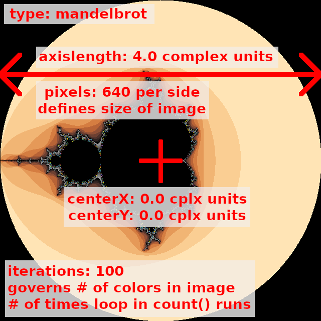
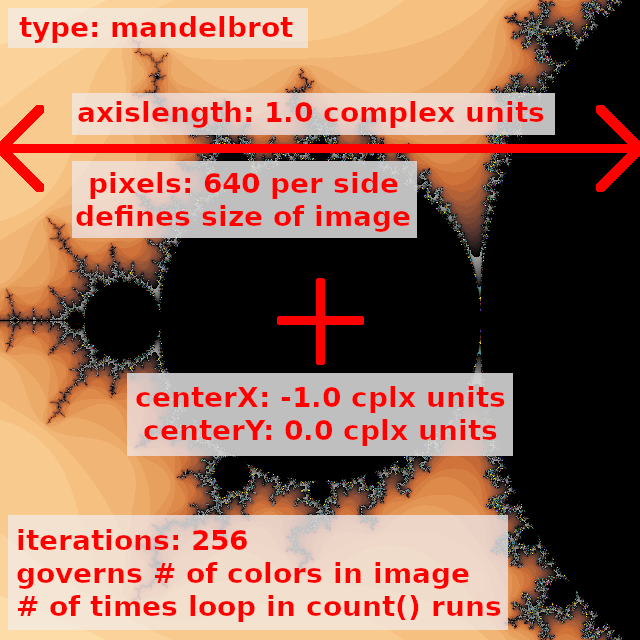

# CS 1440 Assignment 4.1 Instructions

## Description

Take this fractal generating program to the next level by applying good
principles of *Object-Oriented Design*.  Your goal is to create a program that
can stand the test of time by being easy to test, modify and extend.

Additionally, because your program accepts input files in a standard format,
you will be able to share your fractal creations with your classmates.


## Previous Semester Assignment Statistics

Statistic                        | Value
--------------------------------:|:---------------
Average Hours Spent              | 10.75
Average Score % (Grade)          | 88.3% (B+)
% students thought this was Easy | 3.9%
... Medium                       | 51.0%
... Hard                         | 26.5%
... Too Hard/Did not complete    | 18.6%


## Overview

After successfully refactoring your client's program into a form which is
easier to work on and think about, you are ready to take this program to the
next level.  In this sprint you will apply the [Factory
Method](https://sourcemaking.com/design_patterns/factory_method) design pattern
to your code.  Through judicious use of this design pattern your program will
evolve from being merely maintainable to easily extensible.  A little bit of
planning and energy spent now will set the stage for many years of smooth
maintenance in the future.


## Objectives

-   Re-organize modules into Polymorphic (duck typed) classes
    -   Take advantage of code reuse through *inheritance*
-   Use the *Factory Method* design pattern to easily create new fractal & palette objects at runtime
-   Employ the *Strategy* design pattern to make a program can pick an appropriate algorithm from user input
    -   Implement hard-coded default behaviors which may be overridden by user
-   Update the documentation (UML, manual, etc.) from the previous assignment so that it remains congruent with final product
-   Perform detailed integration testing to prove that your design is robust


## Submission Instructions

*   Tag commits at the end of select phases of the SDP:
    1.  Tag `A4.1-analyzed` on the commit at the end of **Phase 1: System Analysis**
        *   Submission should include:
            *   Work finished on Software Development Plan phases 0 and 1, including relevant updates to `Plan-4.1.md`
            *   `Signature.md` updated
    2.  Tag `A4.1-designed` on the commit at the end of **Phase 2: Design**
        *   Submission should include:
            *   Work finished on Software Development Plan through phase 2, including pseudocode and relevant updates to `Plan-4.1.md`
            *   `Signature.md` updated
            *   First draft of `Manual.md` describes the expected final product
            *   `Phase-2-UML` is created and matches your currently planned approach
    3.  Tag `A4.1-implemented` on the commit at the end of **Phase 3: Implementation**
        *   Submission should include:
            *   Work finished on Software Development Plan through phase 3, including relevant updates to `Plan-4.1.md`
                *   We do *not* require Phase 3 to be filled out in `Plan-4.1.md`, but you may want to document notable events that happen during implementation (such as removing an unnecessary function/class)
                *   DO NOT COPY SOURCE CODE INTO PHASE 3 OF THE PLAN FILE *unless* it is directly relevant to a notable event you document
            *   Majority of source code is implemented
            *   `Signature.md` updated
            *   Updated draft of `Manual.md` describes the current product in detail
            *   `Phase-2-UML` is updated to match your current source code
    4.  Tag `A4.1-tested` on the commit at the end of **Phase 4: Testing & Debugging**
        *   Submission should include:
            *   Work finished on Software Development Plan through phase 4, including relevant updates to `Plan-4.1.md`
            *   All unit tests should be completed, non-trivial, and passing
            *   Necessary updates and fixes to source code are applied
            *   `Signature.md` updated
    5.  Tag the final commit of this sprint `A4.1-deployed`.
        *   Submission should include:
            *   Updated `README-4.1.md` with notes for your grader, if necessary
            *   Finalized `Signature.md` and `Plan-4.1.md` files
            *   Updated `Manual.md` file to match the final product
            *   Finalized `Phase-2-UML` that matches your final implementation
*   Push tags to GitLab before the due date
    *   Mind the capitalization and spelling of your tags!
    *   `$ git push origin master A4.1-analyzed A4.1-designed A4.1-implemented A4.1-tested A4.1-deployed`
*   You can give one commit many tags
    *   For example, if you complete multiple phases in one commit, apply all relevant tags
    *   **IMPORTANT:** Having many different commits and having your tags on different commits will make it easier for your grader to know if work was properly done at the expected times
*   These tags don't necessarily need to be in the above order, but all should be present
    *   Likewise, it is okay to change files after its phase is over; you don't need to move the tags when this happens
    *   We recommend following the above order, as it is the order your project *should* be created in


## Requirements

0.  Define a `Fractal` abstract class and *three* concrete sub-classes
    -   The `Fractal` abstract class exists solely to provide a common structure to the concrete classes that inherit from it.
        -   Your program will not create plain `Fractal` objects.
        -   It will instead use classes derived from `Fractal` through inheritance.
    -   `Fractal` provides a placeholder `count()` method which raises an exception when called.
        -   It consists solely of this statement: `raise NotImplementedError("Concrete subclass of Fractal must implement count() method")`
    -   You are allowed (but not required) to define data members in the `Fractal` class that may be used by derived classes.
        -   You can call `Fractal`'s `__init__` from a derived classes' initializer like this:
            ```python
            # call parent class initializer with 0 parameters:
            super().__init__()
            
            # call parent class initializer with 3 parameters:
            super().__init__(a, b, c)
            ```
    -   You are allowed (but not required) to define other methods besides `count()`.
        -   These methods are available to all derived classes of `Fractal`.
        -   These methods do not need to raise `NotImplementedError`.
    -   The `Julia` and `Mandelbrot` classes inherit their structure from `Fractal`, and are obligated to provide their own implementations of `count()` such that they do not raise `NotImplementedError` when used.
    -   `count()` takes one complex number as input and returns an integer that is the number of iterations tried before the absolute value of the fractal formula grew larger than `2.0`; otherwise the maximum number of iterations is returned.
        -   This operation is the defining characteristic of an object derived from the `Fractal` class.
    -   Other data needed by `count()` are supplied through the `self` reference.
    -   Define at least **one** new concrete subclass of `Fractal` following the pattern set forth by `Julia` and `Mandelbrot` but using different formulae.
        -   You may choose from
            *   [Mandelbrot3 and Mandelbrot4](http://usefuljs.net/fractals/docs/multibrot.html)
            *   [Phoenix, BurningShip, and BurningShipJulia](http://usefuljs.net/fractals/docs/mandelvariants.html)
        -   You may also devise your own fractal formula.  Get creative!
        -   If your new fractal class requires new configuration parameters, augment your `FractalFactory` class to handle then.
    -   The concrete sub-classes of `Fractal` are used _interchangeably_ in your program.
        -   This is an example of *polymorphism* in action: objects of different classes which are used in the same way.
        -   The code which uses a `Fractal`-derived object does not inspect the object to determine what kind of fractal it is; it just works because it defines the `count()` method.
            -   Directly inspecting the type of an object (i.e. checking `isinstance(frac, Julia)`) before use defeats the purpose of polymorphism.  A submission that does this will lose points.
    -   `Fractal` objects have no relation whatsoever to `Palettes`, nor any knowledge about `Colors`.
        -   Information that relates to a `Palette` (such as its length) can be known by a `Fractal` object if needed, **but your fractal should not get this information from a `Palette` object or the `Palette` module directly**
1.  `FractalFactory` class or module
    -   Follow the [Factory Method Pattern](https://sourcemaking.com/design_patterns/factory_method) in your program when you need to instantiate objects embodying fractal algorithms.  `FractalFactory` returns a concrete fractal object based upon a configuration file given to it from the main program.  See below for details about the format of the fractal configuration file.
    -   The file defining `FractalFactory` is the only place in your entire program where your concrete `Fractal`-derived classes need to be imported.
    -   The `FractalFactory` itself doesn't have to be an object that you instantiate; it can be a function within a module.
        -   For example, this is how a `FractalFactory` object would be used:
        -   ```python
            from FractalFactory import FractalFactory
            
            fractalInfo = ... # get a data structure about the fractal
            factory = FractalFactory()
            fractal = factory.makeFractal(fractalInfo)
            ```
        - Instead, `FractalFactory` might be a module containing the function `makeFractal()`:
        -   ```python
            import FractalFactory

            fractalInfo = ... # get a data structure about the fractal
            fractal = FractalFactory.makeFractal(fractalInfo)
            ```
    -   When no fractal configuration file is specified by the user on the command line, `FractalFactory` produces a "default" fractal configuration object (or dictionary).
        -   This default object is hard-coded into your program
        -   **Important:** hard-coding the *path* to a fractal configuration file in `data/` is **not acceptable**
        -   Do not assume that directory will be available when your program is run!
2. `FractalParser` class or module
    *   The information provided by this class or module is used as input to `FractalFactory` and `PaletteFactory`
    *   Reads the `.frac` file named on the command line and converts its contents into a form usable by your program
        *   Previously, fractal information was written directly into dictionaries in the program's source code
        *   Now this data is stored externally so that new fractals can be added without needing to re-write the program's source code
        *   *Design Hint: convert this text file's contents in a dictionary instead of returning a `Fractal` object; making a `Fractal` is the responsibility of `FractalFactory`*
    *   Verifies that the `.frac` file named on the command line is correctly formatted
        *   When a missing or inaccessible fractal is called for, simply let the `open()` function fail.
        *   When an unrecognized fractal type is encountered, raise [`NotImplementedError`](https://docs.python.org/3/library/exceptions.html#NotImplementedError)
        *   When a fractal configuration file contains other errors, raise [`RuntimeError`](https://docs.python.org/3/library/exceptions.html#RuntimeError).
            *   Read [Fractal Configuration File Format](#fractal-configuration-file-format) for more details about what these files should contain
3.  Create a `Palette` class and *two* concrete sub-classes
    -   The `Palette` class exists solely to provide a common structure to the concrete classes that inherit from it.  Your program will not create plain `Palette` objects.  It will instead use classes derived from `Palette` through inheritance.
    -   `Palette` provides a placeholder `getColor()` method which raises an exception when called.  It consists solely of this statement: `raise NotImplementedError("Concrete subclass of Palette must implement getColor() method")`
    -   You are allowed (but not required) to define data members in the `Palette` class that are to be used by derived classes.
        -   You can call `Fractal`'s `__init__` from a derived classes' initializer like this:
            ```python
            # call parent class initializer with 0 parameters:
            super().__init__()
            
            # call parent class initializer with 3 parameters:
            super().__init__(a, b, c)
            ```
    -   You are allowed (but not required) to write other methods besides `getColor()`.
        -   These methods do not need to raise `NotImplementedError`.
        -   These methods would then be available in all derived classes of `Palette`.
    -   Concrete subclasses of `Palette` inherit their structure from the abstract class `Palette`, and are obligated to provide their own implementations of `getColor()` such that they will not raise `NotImplementedError` when used.
    -   `getColor(n)` takes an integer as input and returns a string which represents a color in this format: `"#RRGGBB"`.
        -   This operation is the defining characteristic of a  `Palette`  object.
    -   Other data used by `getColor(n)` are supplied through `self`.
    -   Define at least **two** concrete subclasses of `Palette` classes that provide alternative color palettes.
        -   Generalize color palette creation so that a user-defined number of iterations may be specified instead of using a hard-coded array of colors.
            -   Take some time to make your color palette *look good* for any number of iterations between 64 and 512.  Transition between opposing colors to increase the contrast and detail in the final image.
            -   Some programmers use the modulus `%` operator to create color palettes  of "repeating stripes" to gracefully handle large iteration counts. You *may* do this for some of your color palettes, but **at least one** palette must by *dynamically generated* using the `colour` module and the `Color.range_to` method.
    -   The concrete sub-classes of  `Palette`  are used _interchangeably_ in your program.  This is an example of polymorphism in action: objects of different classes which are used in the same way.  The code which uses a `Palette`-derived object does not inspect the object to determine what kind of palette it is; it just works because it defines the `getColor()` method.
            -   Directly inspecting the type of an object (i.e. checking `isinstance(pal, ColorCube)`) before use defeats the purpose of polymorphism.  A submission that does this will lose points.
    -   `Palette` objects have no relation to nor knowledge of `Fractal` and its derived classes, nor should it expect to be used directly by a `Fractal` object.
4.  `PaletteFactory` class or module
    -   Follow the [Factory Method Pattern](https://sourcemaking.com/design_patterns/factory_method) in your program when you need to instantiate objects embodying palettes.  `PaletteFactory` returns a concrete palette object specified by the user on the command line.
    -   The file defining `PaletteFactory` is the only place in your entire program where your concrete `Palette`-derived classes need to be imported.
    -   The `PaletteFactory` itself doesn't have to be an object that you instantiate; it can be a function within a module.
        -   ```python
            from PaletteFactory import PaletteFactory
            
            factory = PaletteFactory()
            palette = factory.makePalette(paletteName)
            ```
        -   Instead, `PaletteFactory` might be a module containing the function `makePalette()`:
        -   ```python
            import PaletteFactory
            
            palette = PaletteFactory.makePalette(paletteName)
            ```
    -   When no palette is specified on the command line, `PaletteFactory` chooses and returns a default palette.  As the author of this factory, you get to decide which palette is the default.  This choice is _not_ coded into the `main.py` driver program; it is wholly under the purview of the factory.
        -   This does not mean that your factory returns a hard-coded array of colors
        -   Pick from among your available color palette classes and return one of them as an object.
    -   When a non-existent palette is asked for, `NotImplementedError` is raised
        ```python
        raise NotImplementedError("Invalid palette requested")
        ```
    -   `PaletteFactory` needs some information about a fractal to properly construct a `Palette` to be used with it (e.g. the number of iterations).  Information returned by `FractalParser` *may* be given to `PaletteFactory`.  However, the actual `Palette` object *should not* contain or use the `fractalInfo` object directly.
    -   ```python
        import FractalParser
        import PaletteFactory

        fractalInfo = FractalParser.parseFracFile(sys.argv[1])
        palette = PaletteFactory.makePalette(paletteName, fractalInfo)
        ```
5.  `ImagePainter` class
    -   Continuing the work of the last sprint, convert this module into a class
        -   This class remains the *only* place in the program where `tkinter` is imported and used directly
    -   The `ImagePainter` constructor takes the products of the `FractalFactory`, `PaletteFactory`, and `FractalParser` as input
        -   Create the `ImagePainter` object in `main.py` **after** the factories have done their thing
        -   The `ImagePainter` does not use or know about the factories; it simply consumes their products
        -   Neither does the `ImagePainter` know about command-line arguments or `.frac` files
            -   It *may* see a data-structure which stores the result of parsing this `.frac` file
    -   The `ImagePainter` employs the **Strategy Design Pattern** when it calls a fractal object's `.count()` method
        -   `ImagePainter` does **not** use an `if`/`elif`/`else` decision tree that handles each type of fractal individually
        -   It relies on Duck-Typing to treat all `Fractal`s exactly the same
        -   `ImagePainter` *directly* takes advantage of polymorphism and the fact that each `Fractal` "quacks" the same way with the `Fractal.count` method
6.  Documentation (UML, user manual, etc.) from the previous assignment is congruent with final the product.  List the names of possible palettes in the user manual as this program will not regard absent command line arguments as an error and will not print a usage message.
7.  Seven (7) meaningful, non-trivial unit tests are included.
    -   All of them pass.


## Command line interface

The command line interface to your program must follow this format:

```
python src/main.py [FRACTAL_FILE [PALETTE_NAME]]
```

0.  `FRACTAL_FILE` is the name of a fractal configuration file found in the data directory of the original repository.
    -   It is an error if this file name is misspelled, or refers to a file which your program cannot open.
    -   It is also an error when this file does not follow the format described below.
1.  `PALETTE_NAME` is an optional name of a palette which your `PaletteFactory` can produce.

When zero arguments are given, your factories create and return default objects. For example:

```
$ python src/main.py
FractalFactory: Creating default fractal
PaletteFactory: Creating default color palette
```

**IMPORTANT: Because of this behavior, this program *cannot* print a usage message when no arguments are given.**  Instead, users will rely on the user's manual to learn how to run your program.


When only one argument is given, it is used as the name of a fractal configuration file.  A default color palette is chosen by the program:

```
$ python src/main.py data/fulljulia.frac
PaletteFactory: Creating default color palette
```

When two arguments are given, the first is used as the name of a fractal configuration object and the second is the name of a color palette:

```
$ python src/main.py data/funnel-down.frac ColorCube
```

When an missing, or inaccessible fractal configuration file is given, the program may exit with the error raised by `open()`:

```
$ python src/main.py data/NOT_EXIST ColorCube
Traceback (most recent call last):
  File "src/main.py", line 26, in <module>
    fractal = FractalParser.parseFracFile(fracFileName)
  File "/home/fadein/cs1440-falor-erik-assn4/src/FractalParser.py", line 30, in parseFracFile
    with open(cfgFile) as f:
FileNotFoundError: [Errno 2] No such file or directory: 'data/NOT_EXIST'
```

**IMPORTANT: Do not hard-code any assumptions about where these files may be found into your program.**


When an invalid palette name is requested, the program exits with an error message

```
$ python src/main.py data/funnel-down.frac NOT_EXIST
Traceback (most recent call last):
  File "src/main.py", line 27, in <module>
    palette = PaletteFactory.makePalette(fractal.iterations, gtype=palette)
  File "/home/fadein/cs1440-falor-erik-assn4/src/PaletteFactory.py", line 49, in makePalette
    raise NotImplementedError("Invalid palette requested")
NotImplementedError: Invalid palette requested
```

### Default Fractal Requirements

We give you a lot of latitude to choose your default fractal and default palettes.  These requirements are placed upon your default fractal to keep the program's default behavior within a reasonable run-time and to ensure it illustrates your programs capabilities.

The default fractal should meet these requirements:

0.  Be no larger than `640x640` and no smaller than `256x256` in size
1.  The maximum-iteration value be between `64` and `256`
    *   The default color palette must be dynamically generated for the maximum iteration value you choose
2.  The picture that is drawn must be of some "fascinating" fractal behavior
    *   What is considered "fascinating" is very subjective; we are looking for notable variation in your default fractal's image, and not a mostly-blank canvas
    *   Choose a default fractal that produces an enticing image 
    *   The default fractal will be the first impression your program leaves on our client; make it a good one!
3.  The default fractal's configuration information is directly hard-coded into the source code, and is *not* sourced from an external `.frac` file by means of a hard-coded file path.
    *   Hard-coding a path makes your program crash when it is not run from a specific directory

Not adhering to the above requirements will result in a **10 point penalty**.


## Fractal configuration file format

Fractal configuration files have a simple format.  They are line-oriented
plain-text files with one key/value pair per line.  Key/value pairs are
separated by a colon `:`.  This format is easily converted into dictionaries by
your program.  Dictionaries are not the only way to store this data; you may
choose another data structure (or create your own) that stores and allows one
to validate this `.frac` file data.

Study the files in the [../data/](../data/) directory.  Take particular notice
of the file [../data/invalid.frac](../data/invalid.frac), which is an example
of what **NOT** to do!

*   Lines beginning with `#` are comments to be ignored
*   All white space is disregarded
    *   Blank lines are skipped
    *   Strip all white space from the input data
*   Configuration items can appear in *any* order...
    *   ...since you will store them in a dictionary this does not matter
    *   If a configuration item is repeated, the last one overrides what came before
*   The names of configuration items are case-insensitive
    *   UPPERCASE, lowercase, or a MiXtUrE don't matter
    `axislength`  ==  `axisLength` ==  `AXISLENGTH`
    *   Convert all text to lower case as you read it into your program.
*   Item names are separated from their values with a colon `:`
    *   White space around the `:` is *optional*; don't count on it being there
*   The presence of unrecognized or misspelled item names is **NOT** an error
    *   Your program may add these to the dictionary OR ignore them
*   It is an error when items marked **required** below are not present in the configuration file
*   The data type of configuration items used by your program matters
    *   It is an error to supply a value of the wrong type
    *   It is an error to leave a value blank


### Valid items in fractal configuration files

*   `type` - *str* **required**
    *   Informs the program which fractal formula to apply.
    *   For example, this may be `Mandelbrot`, `Julia` or `BurningShipJulia`.
    *   You will define new fractal types that your program can support.
*   `centerX` - *float* **required**
    *   The center point of the image along the X axis.
    *   a.k.a. the "real" axis.
*   `centerY` - *float* **required**
    *   The center point of the image along the Y axis
    *   a.k.a. the "imaginary" axis.
*   `axisLength` - *float* **required**
    *   Defines the size of the square on the complex plane this image covers.
    *   Because the images are square, both axes are the same size.
    *   Making this value smaller results in a *zoomed-in* image.
    *   Making this value larger results in a *zoomed-out* image.
*   `pixels` - *int* **required**
    *   The width (and height) of the image in pixels.
    *   Increasing this parameter increases:
        *   the size of the image.
        *   the amount of detail visible in the image.
        *   the amount of time it takes to generate the image.
*   `iterations` - *int* **required**
    *   The number of iterations the central `for` loop runs before giving up on coloring a pixel.
    *   This is equal to the number of colors in the image.
    *   Increasing this parameter means increasing...
        *   ...the amount of time it takes to render the image
        *   ...the amount detail visible in the image, provided your color palette has enough distinct, contrasting colors
*   `creal` and `cimag` - *float* **optional**
    *   The real and imaginary components of the `C` constant which is used by fractals defined by a variation of the Julia formula.
    *   These items are **required** only for fractals using a variation of the Julia formula.
    *   Your program should raise an error if either of these are missing when `type == julia` or `burningshipjulia`.
    *   These configuration items are ignored by the Mandelbrot forumula.
    *   Experiment with different values to make your Julia set images more interesting.

The meaning of the items within configuration files are illustrated by these images:

#### data/mandelbrot.frac



#### data/mandelbrot-zoomed.frac




### Fractal configuration dictionaries

As your program reads data from a configuration file, it should store the
information into a dictionary.  This dictionary can then easily be passed to
other parts of the program, such as the method that generates the image.

You may find it to be more convenient for your algorithm if the data is first
"conditioned", or converted into a form that is easier to work with.  It is
perfectly acceptible to do this and to store the conditioned data in the same
dictionary.

As an example, upon reading the fractal configuration found in
`data/mandelbrot.frac` my implementation creates a dictionary containing
this information:

```
{
    'type': 'mandelbrot',
    'pixels': 640,
    'axislength': 4.0,
    'iterations': 100,
    'min': {
        'x': -2.0,
        'y': -2.0
    },
    'max': {
        'x': 2.0,
        'y': 2.0
    },
    'pixelsize': 0.00625,
    'imagename': 'mandelbrot.png'
}
```

Note the addition of computed values alongside parameters contained in
the configuration file.

*   The  `min`  and  `max`  values are trivially computed from (`centerX`, `centerY`) and `axisength`, giving the coordinates in the complex plane of the image pixels at the upper left and lower-right corners of the image.
*   Likewise, the length of each pixel of the image in terms of distance on the real and imaginary axes is given as `pixelsize`, which is easily obtained from  `pixels`  and  `axislength`.
*   `imagename` was added by the program for my convenience; you can do the same if it suits you.


### Handling errors in fractal configuration files

-   We will follow the convention that fractal configuration files have the extension .frac, but your program *will not* enforce this.
    -   In other words, your program accepts *any* file *regardless* of its name.
-   Required parameters which are missing are considered an error.
-   Missing or invalid values are likewise to be considered as errors.


[../data/invalid.frac](../data/invalid.frac) is a fractal configuration file which contains errors.  Use it to test that your program can cope with invalid input files.


```
# invalid.frac
#
# This is a purposefully broken fractal config file
# Use this to stress-test your configuration file parser


# Here be dragons!
Type: BurningShipJulia
centerX: in the middle
centerY:
Itertons: 23.654
PIXELS: 894.965
cImag: 0.3
Type: this is redundant
Type: no matter, this will all be forgotten in a moment
Type: julia
```

As explained above, capitalization of text in this file is irrelevant, as are the redundant `Type` parameters.

These are the errors:

-   `centerx`'s value is not a number; the coordinates of the center point are regarded by the program as floats
-   `centery` is missing a value
-   `iterations` was misspelled
    -   The unrecognized item `Itertons` is ignored, which results in `iterations` not being specified at all
-   The value of the `pixels` must be an integer, not a float
-   The required parameter `axislength` is missing
-   The `type` of this fractal is `julia`, but the required `creal` property is missing

When errors are encountered your program must raise a `RuntimeError` with a
message.  To aid debugging, strive to be as specific as you can about what's
wrong:

*   `raise RuntimeError("The value of the 'centerx' parameter is not a number")`
*   `raise RuntimeError("The value of the 'centery' parameter is missing")`
*   `raise RuntimeError("The value of the 'pixels' parameter is not an integer")`
*   `raise RuntimeError("The required parameter 'iterations' is missing")`
*   `raise RuntimeError("The required parameter 'axislength' is missing")`
*   `raise RuntimeError("This is a Julia fractal, but the 'creal' parameter was not specified")`
